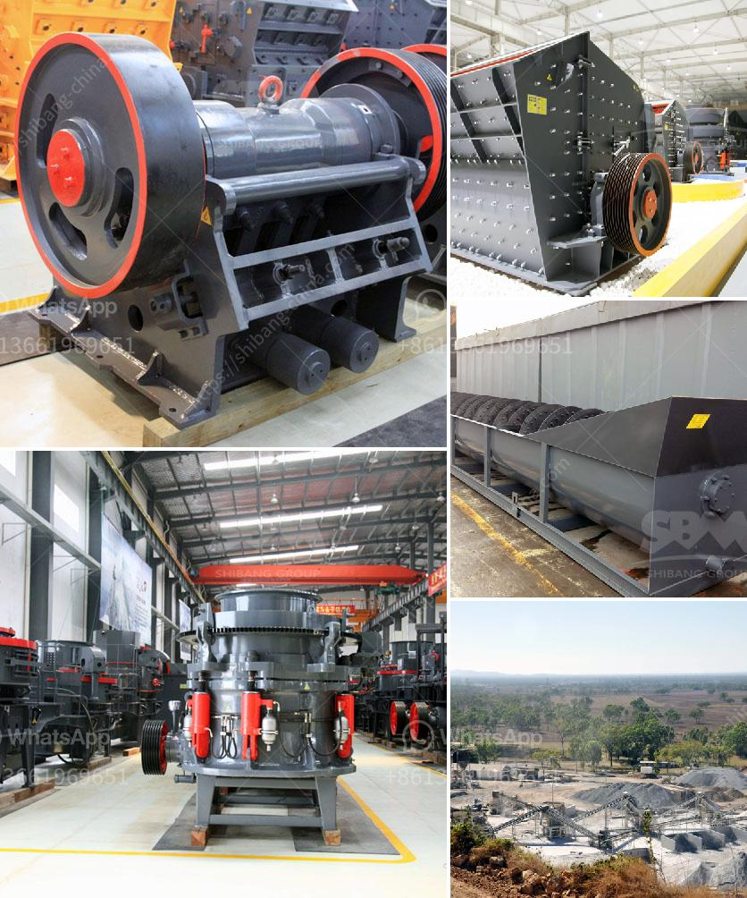

<h3>list of equipment used in iron ore mining</h3>
Iron ore mining is a high-volume, low-margin business that is typically performed using large, mechanized equipment. The most common machines used in iron ore mining are excavators, loaders, crushing machines, grinding mills, drills, blasting and hauling equipment. With heavy mining equipment, the iron ore mining process begins by drilling holes into the earth’s surface to remove the overburden rock and extract the iron ore.

The extracted ore is then transported from the mine site to the crushing and screening plant, where it is processed further into different size fractions. The final product is stored in stockpiles before being transported to the customers via rail or ship.

One of the primary tools used in iron ore mining is the Iron Ore Rock Drill or Blast Hole Drill. This is the equipment that is used in the discovery of mineral-bearing ore bodies in mines. The drilling bit is essential for penetrating the earth's crust and extracting the ore samples. Once the ore samples have been obtained, they can be analysed to determine the concentration of iron as well as other minerals present in the ore.

In addition to the drilling equipment, there are other mining tools used in the industry. These include the Scrapers, Dozers, Graders, and Excavators. Scrapers are used in surface ore mining and are used to scrape the surface of the earth in order to extract the mineral-bearing ore. Dozers are used to move the overburden and excavate the mineral-bearing ore. Graders are used to properly grade the mined ore, while Excavators are used to remove the waste material and extract the ore.

Another important tool in the iron ore mining process is the mobile fleet. These large-scale machinery and equipment are pivotal in the mining industry. Not only do these machines enable iron ore producers to extract, process, and transport the ore efficiently, but they also minimize environmental impact. The end result is a raw iron ore product that is iron-rich in content.

Crushing equipment and grinding mills play an essential role in the mining industry, and they are primarily used in the processing of iron ore. Different crushers are used for different purposes, such as primary, secondary, and tertiary crushing. They are mainly used to crush coarse minerals like coal, limestone, granite, and iron ore, and widely used in mining, metallurgy, and construction industries.

After crushing, iron ore grinding equipment is needed. Grinding mills are used to reduce the size of the ore particles and expose the mineral surfaces to the leaching process. As a result, they grind the ore into smaller particles, increasing the surface area and thus facilitating the subsequent leaching process.

Overall, the mining process for extracting iron ore involves blasting, crushing, grinding, magnetic separation, flotation, and finally filtration and drying. The resulting concentrated ore is then transported to smelters, where it is used to produce usable iron. These iron-making processes require considerable energy inputs and therefore need to be highly efficient to maximize productivity. The use of technologically advanced equipment ensures that the mining process is efficient, cost-effective, and environmentally friendly. In conclusion, the equipment used in iron ore mining varies depending on the type of mining operation and its scale.
<h3>Contact us</h3><ul><li><strong>Whatsapp:&nbsp;<a href="https://wa.me/8613661969651">+8613661969651</a></strong></li><li><a href="https://swt.shibang-china.com/?git&amp;zhl&amp;list of equipment used in iron ore mining"><strong>Online Service(chat now)</strong></a></li></ul><h3>Related</h3><ul><li><a href='gypsum grinding mill for chalk factory.md'>gypsum grinding mill for chalk factory</a></li><li><a href='china pasir harga washing plant.md'>china pasir harga washing plant</a></li><li><a href='conveyor belt supplier in riyadh.md'>conveyor belt supplier in riyadh</a></li><li><a href='price of small scale cement plant in india.md'>price of small scale cement plant in india</a></li><li><a href='raymond mill price.md'>raymond mill price</a></li></ul>