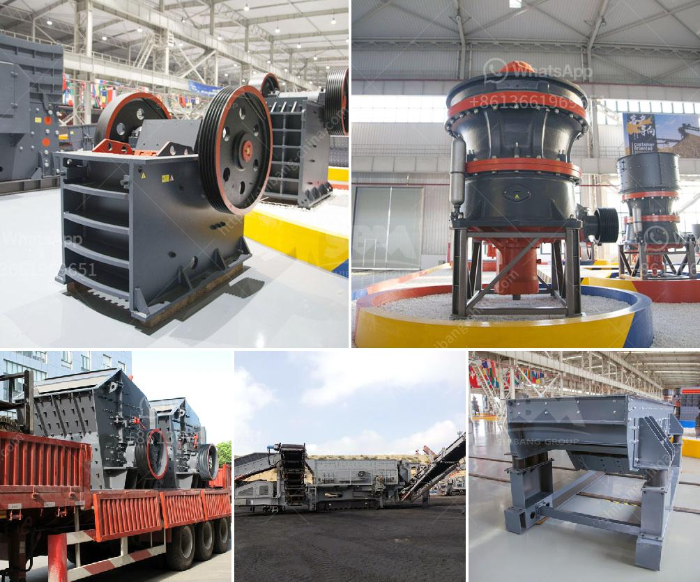

<h3>list of machineries for marble processing plants</h3>
Marble is a beautiful and versatile natural stone that has been widely used in construction and interior design for centuries. From flooring and countertops to sculptures and intricate architectural details, marble adds elegance and sophistication to any space. To meet the growing demand for marble products, marble processing plants employ a range of advanced machineries that facilitate the cutting, shaping, and polishing of marble blocks into finished products. In this article, we will explore some of the essential machineries used in marble processing plants.

1. Diamond Wire Saw: One of the primary tools in marble processing plants, the diamond wire saw is used to cut large marble blocks into manageable sizes. The wire, coated in industrial-grade diamonds, is passed through the marble block, resulting in a clean and precise cut.

2. Gang Saw: The gang saw is a large, motorized machine with multiple blades that horizontally cut marble blocks into slabs of desired thickness. This machinery is capable of cutting multiple slabs at once, increasing productivity in marble processing plants.

3. Bridge Saw: As the name suggests, the bridge saw consists of a bridge-like structure with a diamond blade mounted on it. This versatile machinery is used to cut marble slabs into various shapes, such as tiles, kitchen countertops, and vanity tops, with great precision and accuracy.

4. Waterjet Cutter: This high-pressure water jet combined with abrasive material is used to create intricate and detailed designs on marble surfaces. The waterjet cutter can etch patterns, logos, and even reproduce photographs onto marble slabs and tiles.

5. Polishing Machine: Once the marble has been cut and shaped, it undergoes a polishing process to enhance its natural shine and smoothness. Polishing machines use abrasive pads or diamond stones that rotate at high speeds to buff the marble surface, giving it a glossy finish.

6. CNC Machine: Computer Numerical Control (CNC) machines have revolutionized the marble processing industry. These automated machines are programmed to execute intricate cutting, carving, and shaping tasks with high precision. CNC machines eliminate human error and ensure consistent and accurate results.

7. Edge Polishing Machine: This specialized machinery is used to polish and shape the edges of marble slabs and tiles. It creates a smooth, beveled, or bullnose edge, depending on the desired finish.

8. Calibration Machine: Marble slabs and tiles often go through a calibration process to ensure uniform thickness. Calibration machines utilize abrasive stones to grind the surface of marble to the desired thickness, resulting in even and well-matched tiles and slabs.

9. Resin Line: Marble slabs with natural fissures or cracks are often strengthened using a resin line machine. The machine fills the cracks with resin and bakes the slabs under high temperatures, which strengthens the marble and enhances its durability.

10. Water Recycling System: Marble processing plants consume a significant amount of water. To minimize water wastage, many plants employ a water recycling system that purifies and reuses water, ensuring a more sustainable and environmentally friendly operation.

In conclusion, marble processing plants rely on a range of advanced machineries to transform raw marble blocks into stunning finished products. From cutting and shaping to polishing and finishing, these machineries help create beautifully crafted marble slabs, tiles, and other decorative items that adorn our homes, buildings, and public spaces.
<h3>Contact us</h3><ul><li><strong>Whatsapp:&nbsp;<a href="https://wa.me/8613661969651">+8613661969651</a></strong></li><li><a href="https://swt.shibang-china.com/?git&amp;zhl&amp;list of machineries for marble processing plants"><strong>Online Service(chat now)</strong></a></li></ul><h3>Related</h3><ul><li><a href='specifications of a tonnes hour jaw crusher.md'>specifications of a tonnes hour jaw crusher</a></li><li><a href='stone crushing plant layout.md'>stone crushing plant layout</a></li><li><a href='providers conveyor belts in bolivia.md'>providers conveyor belts in bolivia</a></li><li><a href='barite crusher price.md'>barite crusher price</a></li><li><a href='types of limestone screening.md'>types of limestone screening</a></li></ul>