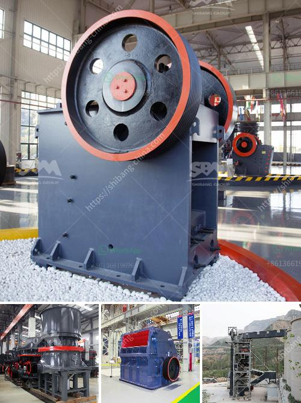

<h3>looking for limestone crushing contractor</h3>
Limestone is a popular material used for various construction purposes such as building foundations, roads, and bridges. As a sedimentary rock composed mainly of calcium carbonate, it is a versatile resource that offers durability, strength, and aesthetic appeal. However, to effectively utilize limestone in construction projects, it needs to be crushed into smaller sizes. This is where a limestone crushing contractor comes into the picture.

When considering a limestone crushing contractor, there are several key factors that one should keep in mind. In this article, we will explore the importance of finding the right contractor and discuss some tips to ensure a successful collaboration.

Firstly, it is essential to work with a contractor who has specialized experience in limestone crushing. Limestone crushing requires specific equipment and techniques to achieve the desired particle size and quality. A contractor who has prior expertise in limestone crushing will be aware of the challenges and be better equipped to handle them. Their understanding of the material properties, crushing process, and maintenance requirements will contribute to a higher quality end product.

Another crucial factor to consider is the contractor's reputation. It is advisable to research and ask for recommendations from trusted sources in the industry. A well-established contractor with a positive track record will have a reputation for delivering quality work on time. Reading customer reviews and testimonials can provide valuable insights into the contractor's credibility and professionalism. Additionally, checking if they hold the necessary licenses and certifications ensures they meet industry standards.

Furthermore, efficiency and productivity should be key criteria when selecting a limestone crushing contractor. Time is often of the essence in construction projects, and delays can be costly. Look for a contractor who can provide timely project estimates and adhere to the agreed-upon timelines. This requires open communication and a clear understanding of project requirements.

The contractor's equipment and resources play a significant role in the crushing process. It is essential to evaluate the contractor's inventory to ensure they have the necessary machinery and tools to perform the job efficiently. Outdated or poorly maintained equipment can lead to delays and compromise the quality of the crushed limestone. A responsible contractor will have a well-maintained fleet and invest in the latest technology to deliver superior results.

Lastly, financial considerations should not be overlooked. While it is important to find a contractor within your budget, making cost the sole determining factor can be risky. Opting for the lowest bid might result in compromised quality or hidden costs down the line. Instead, it is advisable to consider multiple proposals and evaluate them based on their value for money. Look for a contractor who offers competitive pricing without compromising on quality.

In conclusion, finding the right limestone crushing contractor is essential for successful construction projects. By considering factors such as experience, reputation, efficiency, equipment, and finances, one can make an informed decision. Collaborating with a skilled and reliable contractor will ensure the efficient crushing of limestone, resulting in high-quality materials for your construction needs.
<h3>Contact us</h3><ul><li><strong>Whatsapp:&nbsp;<a href="https://wa.me/8613661969651">+8613661969651</a></strong></li><li><a href="https://swt.shibang-china.com/?git&amp;zhl&amp;looking for limestone crushing contractor"><strong>Online Service(chat now)</strong></a></li></ul><h3>Related</h3><ul><li><a href='impact crusher equipment.md'>impact crusher equipment</a></li><li><a href='list of equipment used in iron ore mining.md'>list of equipment used in iron ore mining</a></li><li><a href='barite bulking process.md'>barite bulking process</a></li><li><a href='chrome washing machine plant eluvial mill gold.md'>chrome washing machine plant eluvial mill gold</a></li><li><a href='stone crusher equipment supplier.md'>stone crusher equipment supplier</a></li></ul>