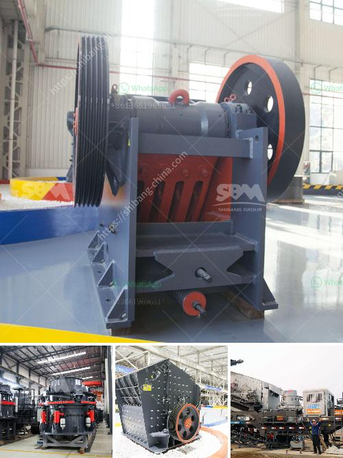

<h3>looking for small coal processing equipment</h3>
Are you in the coal mining industry and looking for small coal processing equipment? If so, you've come to the right place. In this article, we will explore the benefits of small coal processing equipment and guide you on how to find the ideal equipment for your needs. So, let's dive in!

Small coal processing equipment offers numerous advantages for coal mining operations. Firstly, its compact size makes it easier to install and operate in tight spaces. This is especially beneficial for coal mines with limited land availability or for those looking to expand their operations without significant infrastructure changes.

Secondly, small coal processing equipment is cost-effective and energy-efficient. As the equipment has a smaller capacity compared to larger processing plants, it requires less power consumption and maintenance. This results in reduced operational costs, allowing coal mining businesses to maximize their profits.

Additionally, small coal processing equipment provides flexibility and versatility. It can be utilized for different coal sizes and types, making it suitable for a diverse range of mining operations. Whether you are extracting bituminous coal, sub-bituminous coal, or lignite, small coal processing equipment can handle the job effectively.

Now that you understand the benefits, let's discuss how to search for small coal processing equipment that meets your requirements:

1. Define your needs: Determine your coal processing capacity and specific requirements. This includes coal size, moisture content, and desired end products. Having a clear understanding of your needs will help you find the most suitable equipment.

2. Research reputable suppliers: Look for suppliers with a strong reputation in the coal mining industry. Read customer reviews and testimonials to ensure they deliver quality equipment and provide excellent customer service.

3. Reach out to industry contacts: Connect with fellow coal mining professionals or industry organizations. They may have valuable insights or recommendations regarding small coal processing equipment suppliers.

4. Attend trade shows and exhibitions: Participate in industry events to explore the latest advancements in coal processing equipment. These events provide an opportunity to network with suppliers and gain insights into their products.

5. Request quotes and evaluate options: Once you have shortlisted potential suppliers, contact them to request quotes and gather additional information about their equipment. Evaluate the offerings based on your needs, budget, and the supplier's reputation.

6. Consider additional services: Inquire about post-sales support, warranty, installation services, and training programs provided by the suppliers. These factors can contribute to a successful coal processing operation.

7. Take environmental factors into account: With increasing environmental regulations, it is crucial to select equipment that meets the required emission standards and operates efficiently to minimize environmental impact.

In conclusion, small coal processing equipment offers significant benefits for coal mining operations. Its compact size, cost-effectiveness, and versatility make it a valuable asset. By following the steps outlined above, you can find the ideal small coal processing equipment that meets your specific needs. Embrace the advantages of small coal processing equipment and enhance the efficiency of your coal mining operations.
<h3>Contact us</h3><ul><li><strong>Whatsapp:&nbsp;<a href="https://wa.me/8613661969651">+8613661969651</a></strong></li><li><a href="https://swt.shibang-china.com/?git&amp;zhl&amp;looking for small coal processing equipment"><strong>Online Service(chat now)</strong></a></li></ul><h3>Related</h3><ul><li><a href='granite grinder and crushers.md'>granite grinder and crushers</a></li><li><a href='germany stone crusher.md'>germany stone crusher</a></li><li><a href='copper crusher pressure gauge manufacturer.md'>copper crusher pressure gauge manufacturer</a></li><li><a href='hammer mill in china.md'>hammer mill in china</a></li><li><a href='crusher and wash plant for sale in china.md'>crusher and wash plant for sale in china</a></li></ul>