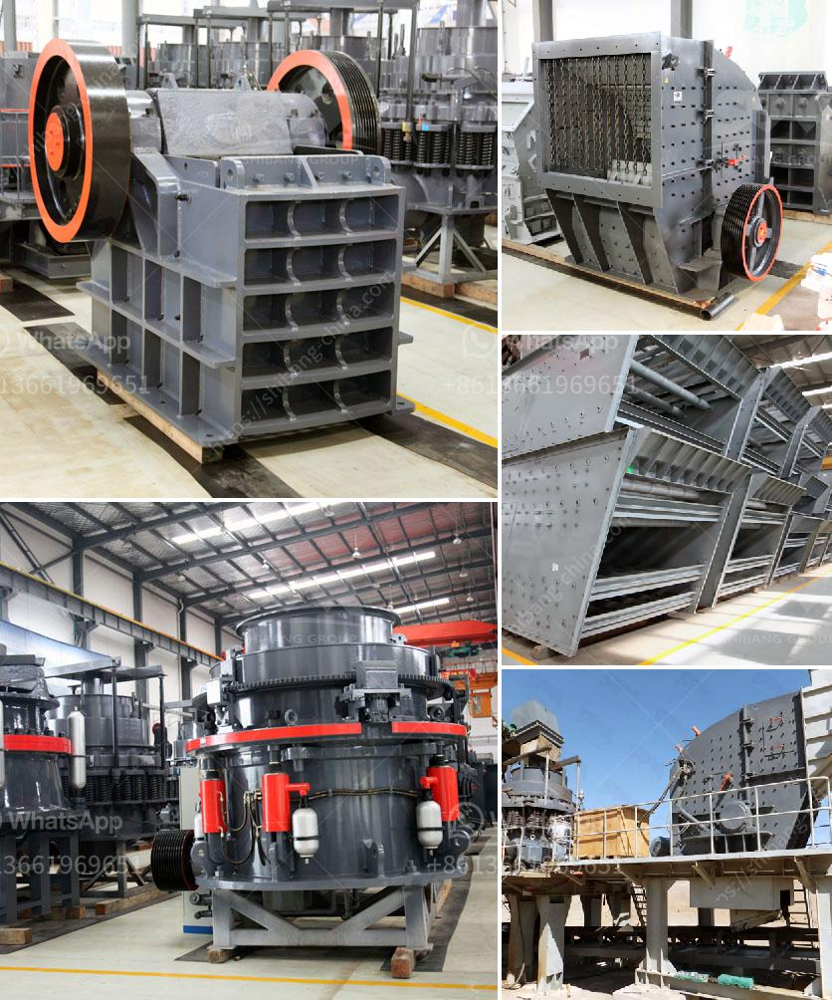

<h3>low cost jaw crusher price in uganda</h3>
Choosing the right crusher for your operations can be a crucial decision. This process involves considering several factors such as the nature of the material to be crushed, the required output, the size of the feed material, and the capacity. While choosing the right crusher, it is essential to understand the different types of crushers available in the market. Low-cost jaw crushers are widely used in industries such as mining, cement, construction materials, ceramics, etc. Nowadays, they have become the most preferred crushers in the market due to their low operational and maintenance costs.

The operation and maintenance costs of jaw crushers are very low, as they require less power, labor, and maintenance costs. As compared to other types of crushers, the jaw crusher has a lower investment cost. As per the capacity, the jaw crusher can handle materials of different sizes, making it suitable for primary and secondary crushing.

One of the key features of the jaw crusher is its ability to handle hard materials effortlessly. Due to its strength, it is suitable for materials such as granite, basalt, quartzite, and other hard rocks. Moreover, a jaw crusher is versatile and can easily crush materials of different sizes. This makes it ideal for various applications such as construction materials, road construction, metallurgy, mining, and many more.

In Uganda, there are a few companies that sell jaw crushers, but the prices vary from one company to another. You can easily find a low-cost jaw crusher in Uganda from a few reputable companies. However, you should be cautious when purchasing crushers because there are counterfeit products on the market. As a reputable supplier with over 30 years of experience, we provide high-quality jaw crushers at competitive prices. Our jaw crushers are reliable, durable, and can meet various crushing requirements.

When purchasing a low-cost jaw crusher, it is important to consider various factors to ensure its performance and longevity. Ensure that the material used for the jaw plates is of high quality and can withstand the pressure exerted by the jaws. The shape of the jaw plates also plays a crucial role in the crushing process. The size of the discharge opening should be adjustable, allowing you to control the final product size. Additionally, check the availability of spare parts and the quality of customer support provided by the company.

In conclusion, a low-cost jaw crusher is a crucial investment that will allow you to save money in the long run. Understanding the different features and advantages of jaw crushers is essential for selecting the most suitable crusher for your operations. As a reputable supplier, we offer high-quality jaw crushers at competitive prices. By choosing our jaw crushers, you will be able to meet your crushing requirements efficiently while minimizing operational and maintenance costs. Contact us today to find out more about our low-cost jaw crushers in Uganda.
<h3>Contact us</h3><ul><li><strong>Whatsapp:&nbsp;<a href="https://wa.me/8613661969651">+8613661969651</a></strong></li><li><a href="https://swt.shibang-china.com/?git&amp;zhl&amp;low cost jaw crusher price in uganda"><strong>Online Service(chat now)</strong></a></li></ul><h3>Related</h3><ul><li><a href='rent a conveyor belts singapur.md'>rent a conveyor belts singapur</a></li><li><a href='industrial grinder machine south africa.md'>industrial grinder machine south africa</a></li><li><a href='jual beli stone crusher bekas.md'>jual beli stone crusher bekas</a></li><li><a href='how to dismantle a cone crusher.md'>how to dismantle a cone crusher</a></li><li><a href='bauxite crushing machine in maharashtra.md'>bauxite crushing machine in maharashtra</a></li></ul>