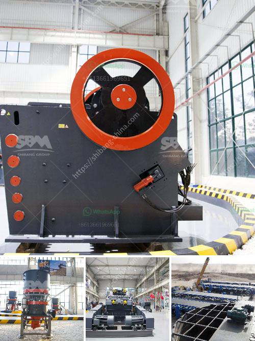

<h3>machine de fabrication de sable de platre</h3>
A machine de fabrication de sable de platre, or a plaster sand manufacturing machine, is a significant piece of equipment in the construction industry. Plaster sand is extensively used for various purposes, such as plastering walls, making decorative molds, and creating intricate designs. This machine plays a vital role in producing high-quality plaster sand efficiently and effectively.

The primary task of a plaster sand manufacturing machine is to crush large-sized rocks or stones into smaller pieces. These smaller pieces are then processed further to convert them into fine sand particles, suitable for plastering purposes. The machine consists of various components, including a feeder, jaw crusher, VSI (Vertical Shaft Impactor) crusher, vibrating screen, and a conveyor belt.

Initially, the rocks or stones are fed into the machine through the feeder. The feeder helps regulate the flow of rocks into the jaw crusher, where they are further crushed into smaller sizes. The crushed stones then enter the VSI crusher, which uses high-speed rotating impellers to impact and break them down into finely shaped sand particles.

After the sand particles are generated, they pass through a vibrating screen to remove any impurities or non-required particles. The vibrating screen ensures that only high-quality plaster sand is obtained, meeting the necessary specifications.

Finally, the plaster sand is transported away from the machine using a conveyor belt for further usage in various construction applications. The machine de fabrication de sable de platre operates on advanced technology and is designed to produce consistent and superior-quality plaster sand.

The advantages of using a plaster sand manufacturing machine are numerous. Firstly, it ensures the availability of high-quality plaster sand, which is essential for creating durable and aesthetically pleasing structures. Secondly, the machine is highly efficient, allowing for a substantial output of plaster sand within a short period. Additionally, it minimizes the need for manual labor, thus reducing human error and increasing productivity.

In conclusion, a machine de fabrication de sable de platre is an essential asset in the construction industry for manufacturing high-quality plaster sand. Its ability to efficiently crush rocks and produce fine sand particles makes it an indispensable tool for creating smooth and flawless surfaces. With its advanced technology and productivity, this machine revolutionizes the process of plastering, ensuring the production of top-notch plaster sand for various construction applications.
<h3>Contact us</h3><ul><li><strong>Whatsapp:&nbsp;<a href="https://wa.me/8613661969651">+8613661969651</a></strong></li><li><a href="https://swt.shibang-china.com/?git&amp;zhl&amp;machine de fabrication de sable de platre"><strong>Online Service(chat now)</strong></a></li></ul><h3>Related</h3><ul><li><a href='crush basalt machine.md'>crush basalt machine</a></li><li><a href='ball mills brands.md'>ball mills brands</a></li><li><a href='impact crusher for sale in bulawayo.md'>impact crusher for sale in bulawayo</a></li><li><a href='lime stone crusher rotor.md'>lime stone crusher rotor</a></li><li><a href='different part of barite and bentonite mill.md'>different part of barite and bentonite mill</a></li></ul>