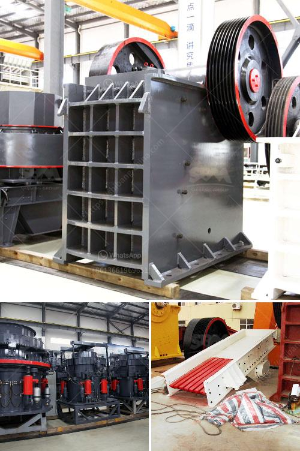

<h3>machine powder gypsum mill</h3>
Machine powder gypsum mill, also known as Raymond mill, is a kind of advanced milling equipment combined with years of experience in grinding industry. It realizes the optimization and improvement of grinding technology, aiming at the characteristics and market demand of gypsum powder. It is widely used in the milling industry with high efficiency and low consumption.

Machine powder gypsum mill is suitable for processing various non-flammable and explosive mineral materials with Mohs hardness below 9.3 and humidity below 6%. It is widely used in metallurgy, building materials, chemical industry, mining, highway construction, water conservancy and hydropower industries. The processed materials include quartz, feldspar, barite, calcite carbonate, limestone, talc, ceramic, iron ore, carborundum, bauxite, rock phosphate, coal and other materials.

The machine powder gypsum mill has the characteristics of high efficiency, low energy consumption, strong processing ability, stable operation, convenient maintenance and environmental protection. The grinding roller and grinding ring are made of wear-resistant materials, which greatly prolongs the service life of the equipment. The base is made of high-quality steel, which is sturdy and durable. The whole machine has low vibration and low noise, creating a comfortable working environment. 

In the production process of machine powder gypsum mill, the materials are evenly and continuously sent into the grinding chamber through the vibrating feeder. The grinding roller swings outwards and presses the grinding ring under the action of centrifugal force. The material is ground into powder between the grinding roller and the grinding ring. The powder is blown to the analyzer by the air blower for grading. The graded powder with the fineness requirements enters the cyclone collector with the airflow. The collected powder is discharged through the powder outlet to become the finished product. 

In addition to its excellent performance, machine powder gypsum mill also has a wide range of applications. It can be used to grind various types of non-metallic minerals with hardness below 7 and humidity below 6%, such as marble, limestone, dolomite, barite, talc, gypsum, diabase, quartz, etc. It can also be used to grind and process more than 280 kinds of materials in industries such as metallurgy, building materials, chemical industry, mining, etc. 

In summary, machine powder gypsum mill is an ideal equipment for processing gypsum powder and other non-metallic minerals. With the continuous innovation and improvement of technology, it has made remarkable achievements in the grinding industry. It not only meets the requirements of customers for milling efficiency and product fineness, but also effectively reduces energy consumption and realizes green and environmental protection production. It plays an important role in promoting the development of the milling industry.
<h3>Contact us</h3><ul><li><strong>Whatsapp:&nbsp;<a href="https://wa.me/8613661969651">+8613661969651</a></strong></li><li><a href="https://swt.shibang-china.com/?git&amp;zhl&amp;machine powder gypsum mill"><strong>Online Service(chat now)</strong></a></li></ul><h3>Related</h3><ul><li><a href='high gradient separator in zhengzhou.md'>high gradient separator in zhengzhou</a></li><li><a href='german technical semi mobile crusher.md'>german technical semi mobile crusher</a></li><li><a href='granite grinder and crushers.md'>granite grinder and crushers</a></li><li><a href='crusher machine factories in coimbatore.md'>crusher machine factories in coimbatore</a></li><li><a href='calcium carbonate powder making.md'>calcium carbonate powder making</a></li></ul>