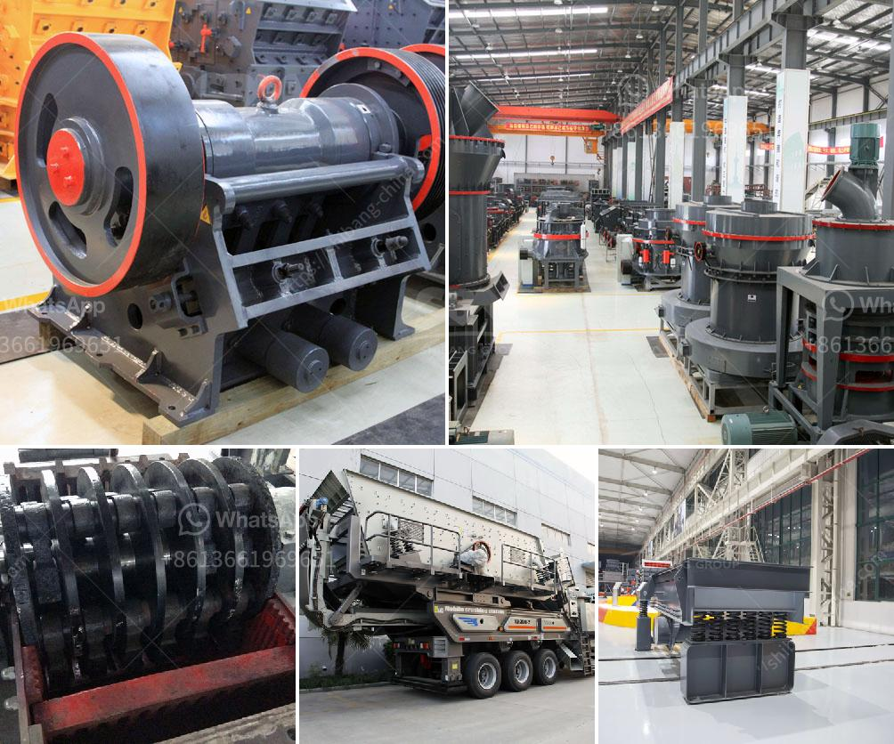

<h3>machine to crush stones for gold from germany</h3>
Germany, famous for its engineering excellence, has always been at the forefront of technological advancements. One such innovation that is making waves in the mining industry is the stone crushing machines. Germany, a leading player in the gold mining industry globally, has embraced these machines to enhance production.

As a part of the renowned mineral resources economy, Germany has a long history of gold mining, dating back to the Roman Empire era. However, with the modernization of mining techniques, the demand for efficient and effective stone crushing machines has increased exponentially.

These machines, specifically designed for the crushing and grinding of stones, are being used extensively in gold mining operations. The main objective of these machines is to process gold-bearing rocks and extract the precious metal. By crushing the stone into smaller particles, it becomes easier to extract the gold, resulting in higher yields and increased profitability.

What sets the German machines apart is their superior quality and efficiency. Made using advanced technology and robust materials, these machines are built to withstand the harsh conditions of the mining environment. With their high crushing capacity and precise control over the size of the crushed material, these machines offer a significant advantage.

Furthermore, these machines are also eco-friendly, as they consume less energy and produce less noise and dust compared to traditional crushing methods. This not only benefits the environment but also improves the overall working conditions for the miners.

The German machines for crushing stones for gold have garnered immense popularity not only in Germany but also across the globe. Mining companies from various countries are now turning to Germany for their stone crushing needs. The reliability, efficiency, and durability of these machines have made them the preferred choice for gold mining operations.

In conclusion, the German machines designed for crushing stones for gold have revolutionized the mining industry. With their advanced technology, high efficiency, and eco-friendly features, these machines are transforming how gold is extracted from the earth. As Germany continues to lead the way in engineering innovation, the stone crushing machines are set to play a vital role in the gold industry's growth and success in the years to come.
<h3>Contact us</h3><ul><li><strong>Whatsapp:&nbsp;<a href="https://wa.me/8613661969651">+8613661969651</a></strong></li><li><a href="https://swt.shibang-china.com/?git&amp;zhl&amp;machine to crush stones for gold from germany"><strong>Online Service(chat now)</strong></a></li></ul><h3>Related</h3><ul><li><a href='tonne mobile crusher for sale philippines.md'>tonne mobile crusher for sale philippines</a></li><li><a href='conveyor belt prices malaysia.md'>conveyor belt prices malaysia</a></li><li><a href='diamond mining equipment for sale south africa.md'>diamond mining equipment for sale south africa</a></li><li><a href='silica sand processing plant flowchart.md'>silica sand processing plant flowchart</a></li><li><a href='mobile crushing unit.md'>mobile crushing unit</a></li></ul>