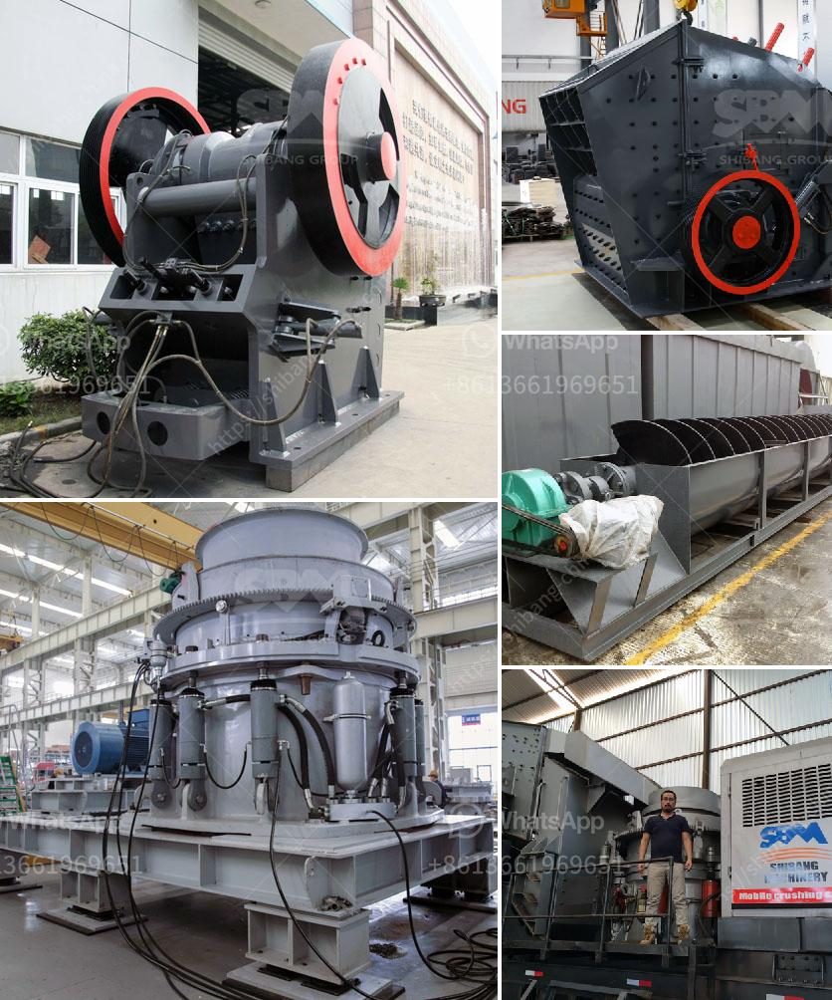

<h3>machinery for copper plant</h3>
Copper production plays a crucial role in various industries, ranging from electrical and automotive to construction and telecommunications. To meet the growing demand for this versatile metal, copper plant owners must invest in advanced machinery. These machines not only enhance productivity but also improve efficiency, ensuring a seamless production process.

One of the essential machines in a copper plant is the copper smelter. This equipment is responsible for converting raw copper ore into pure copper. Smelters utilize various techniques, such as oxidation and reduction, to achieve this transformation. Advanced smelting machines automate the process, reducing human intervention and eliminating potential errors.

Another critical machine in a copper plant is the copper refinery apparatus. Refining is necessary to remove impurities and improve the quality of the copper obtained from the smelting process. These machines use electrolysis, solvent extraction, or other refining methods to achieve the desired level of purity. High-precision refining machinery ensures the final copper product meets industry-specific standards.

Copper wire drawing machines are also vital in a copper plant. These machines pull copper through a series of dies to reduce its diameter, resulting in a fine wire that can be used in electrical applications. Modern wire drawing machines are equipped with advanced technologies, such as servo motors and automatic die change systems, to enhance precision, speed, and reliability.

Furthermore, a copper plant requires efficient material handling equipment to transport raw materials and finished products within the production facility. Forklifts, cranes, conveyors, and hoists play a pivotal role in ensuring a smooth flow of materials, minimizing downtime, and optimizing production capacity.

Investing in the right machinery for a copper plant is crucial to stay competitive in the market. These advanced machines not only improve productivity but also offer energy-saving features, reducing operational costs. Additionally, modern machinery often includes smart systems for real-time monitoring, predictive maintenance, and data analysis, facilitating continuous improvement and maximizing plant performance.

In conclusion, machinery in a copper plant is indispensable to ensure the efficient and cost-effective production of high-quality copper. From smelters and refineries to wire drawing machines and material handling equipment, these machines enable plant owners to meet the increasing demand for copper in various industries. Investing in advanced technology is key to achieving productivity, efficiency, and maintaining a competitive edge in this thriving market.
<h3>Contact us</h3><ul><li><strong>Whatsapp:&nbsp;<a href="https://wa.me/8613661969651">+8613661969651</a></strong></li><li><a href="https://swt.shibang-china.com/?git&amp;zhl&amp;machinery for copper plant"><strong>Online Service(chat now)</strong></a></li></ul><h3>Related</h3><ul><li><a href='quarrying business plant in nigeria.md'>quarrying business plant in nigeria</a></li><li><a href='vibrating screen price philippines.md'>vibrating screen price philippines</a></li><li><a href='mineral pulverizer to 300 micron.md'>mineral pulverizer to 300 micron</a></li><li><a href='mobile crusher plant supplier in the philippines.md'>mobile crusher plant supplier in the philippines</a></li><li><a href='spec for 200 tph crushing plant.md'>spec for 200 tph crushing plant</a></li></ul>