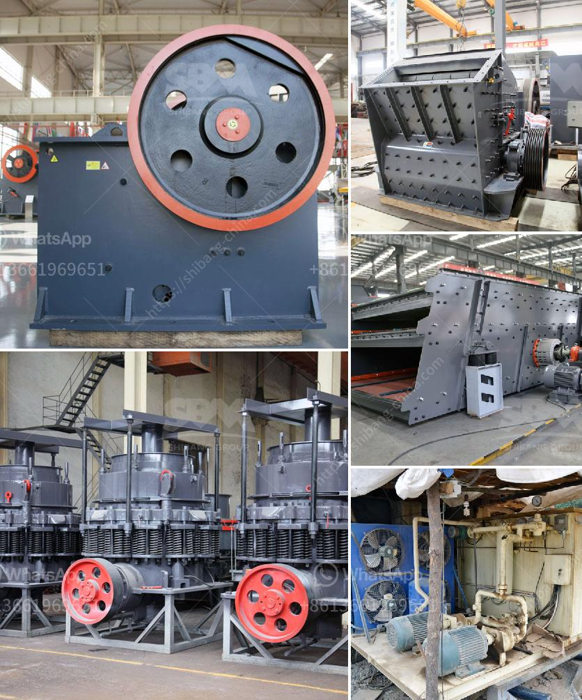

<h3>machines de crushine primaires</h3>
In the ever-evolving world of construction and mining, the advent of machines de concassage primaires, or primary crushing machines, has brought about a paradigm shift. These robust and high-performing machines have revolutionized the way materials are crushed and processed, enhancing efficiency, productivity, and safety on construction sites.

The primary crushing process plays a vital role in various industries, including mining, quarrying, demolition, and recycling. Traditionally, this process involved the use of large, cumbersome equipment that required significant manpower and time. However, with the emergence of machines de concassage primaires, this time-consuming and labor-intensive process has become more streamlined and efficient.

One of the key advantages of these machines is their ability to handle large materials and reduce them to manageable sizes. Equipped with powerful jaws or gyratory cones, primary crushers can break down a wide range of materials, including rock, concrete, and asphalt. The versatility of these machines makes them indispensable in extracting valuable minerals or processing construction waste into reusable aggregates.

Furthermore, machines de concassage primaires have proven to be highly productive, enabling significant savings in both time and costs. By eliminating the need for multiple processing stages, primary crushers can directly produce the desired output size, reducing the overall processing time. This increased efficiency translates into improved productivity and faster project completion, ultimately resulting in cost savings for the operators.

In addition to their efficiency, primary crushing machines prioritize safety on construction sites. Previously, manual labor was required to break down large materials, posing a significant risk to operators. Nowadays, with the implementation of automated controls and safety features, such as remote operation and overload protection systems, the risk of accidents and injuries has been greatly minimized. Operators can now safely control and monitor the crushing process from a distance, ensuring their well-being and the smooth operation of the machine.

Moreover, machines de concassage primaires are designed with durability and longevity in mind. Constructed with high-quality materials and advanced engineering, these machines can withstand the harshest operating conditions and deliver consistent performance. This increased durability reduces downtime and maintenance costs, leading to improved profitability for the operators.

As the demand for various construction materials continues to grow, the importance of machines de concassage primaires becomes increasingly evident. These machines have become a game-changer in the industry, offering a cost-effective and efficient solution for primary crushing operations. Their ability to handle large materials, enhanced productivity, improved safety features, and durability make them an indispensable asset in a wide range of industries.

In conclusion, machines de concassage primaires have transformed the way materials are crushed and processed in construction and mining sectors. With their ability to handle large materials, productivity enhancement, and improved safety features, these machines have become a game-changer for operators. By streamlining the primary crushing process, they contribute to increased efficiency, reduced costs, and sustainable development in the industry. As the market continues to evolve, machines de concassage primaires remain at the forefront, shaping the future dynamics of the crushing industry.
<h3>Contact us</h3><ul><li><strong>Whatsapp:&nbsp;<a href="https://wa.me/8613661969651">+8613661969651</a></strong></li><li><a href="https://swt.shibang-china.com/?git&amp;zhl&amp;machines de crushine primaires"><strong>Online Service(chat now)</strong></a></li></ul><h3>Related</h3><ul><li><a href='quartz movement production process.md'>quartz movement production process</a></li><li><a href='jaw crusher routine service pdf.md'>jaw crusher routine service pdf</a></li><li><a href='used crushing machine price.md'>used crushing machine price</a></li><li><a href='second hand quarry equipment price philippines.md'>second hand quarry equipment price philippines</a></li><li><a href='suppliers of crusher equipment in south africa.md'>suppliers of crusher equipment in south africa</a></li></ul>