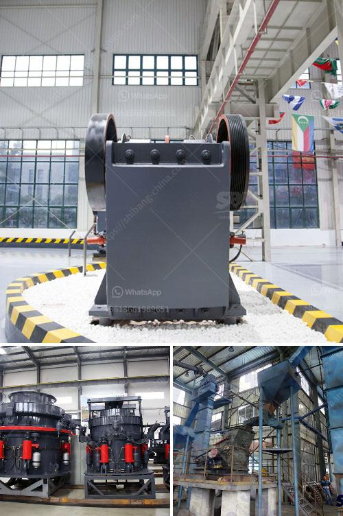

<h3>major suppliers of jaw crusher in south africa</h3>
Jaw crusher has popularity in South Africa and surrounding countries. Jaw crusher is used in many industries and applications, such as the construction and mining industry. As a primary crushing equipment, it plays an important role in the crushing process. Major suppliers of jaw crusher in South Africa are providing quality products to meet the specifications of various industries.

Bell Equipment is a leading manufacturer and supplier of mining equipment. Their jaw crushers are made of high-quality materials and are robust in design. Their jaw crushers deliver consistent performance and have a long service life.

Pilot Crushtec is a leading supplier of crushing, screening, and material handling solutions in South Africa. They provide jaw crushers that are reliable and easy to maintain. Their jaw crushers are designed to handle a wide range of materials, making them suitable for various applications.

Metso is a global supplier of solutions, equipment, and services for rock and minerals processing. Their jaw crushers are highly efficient and are designed to withstand extreme conditions. Metso's jaw crushers are known for their excellent reliability and durability.

Osborn is a leading manufacturer of crushing and screening equipment in South Africa. They offer a wide range of jaw crushers, including a single toggle and double toggle type. Their jaw crushers are reliable and sturdy, and have a high capacity.

Sandvik is a global supplier of equipment and tools, service, and technical solutions for the mining and construction industries. They offer a range of jaw crushers that are engineered for maximum productivity. Sandvik's jaw crushers are designed to be easy to operate and maintain while providing high performance.

Telsmith is a leading manufacturer of crushing and screening equipment, including jaw crushers. Their jaw crushers are designed for high production and have a long service life. Telsmith's jaw crushers are reliable and easy to maintain.

These are just a few of the major suppliers of jaw crusher in South Africa. Each supplier provides unique and high-quality products that meet the specific needs of various industries. Whether it's construction, mining, or any other industry, these suppliers can provide the right jaw crusher for the job.
<h3>Contact us</h3><ul><li><strong>Whatsapp:&nbsp;<a href="https://wa.me/8613661969651">+8613661969651</a></strong></li><li><a href="https://swt.shibang-china.com/?git&amp;zhl&amp;major suppliers of jaw crusher in south africa"><strong>Online Service(chat now)</strong></a></li></ul><h3>Related</h3><ul><li><a href='ball mill machinery supplier manufacturer.md'>ball mill machinery supplier manufacturer</a></li><li><a href='ethiopia cone crusher for sale.md'>ethiopia cone crusher for sale</a></li><li><a href='artificial stone manufacturing process.md'>artificial stone manufacturing process</a></li><li><a href='handmade stone crusher.md'>handmade stone crusher</a></li><li><a href='high crushing ratio low cost jaw crusher machine.md'>high crushing ratio low cost jaw crusher machine</a></li></ul>