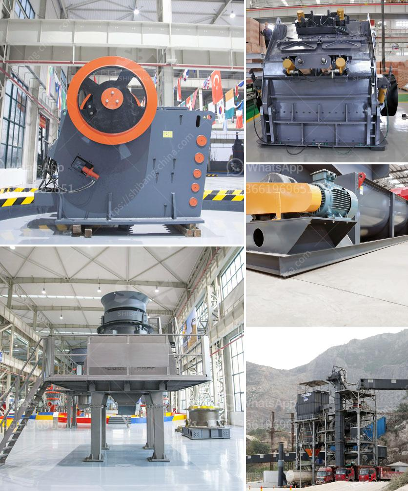

<h3>manganese limestone processing unit</h3>
Manganese limestone, also known as high-grade manganese ore, is an important industrial mineral used in various applications such as steelmaking, battery production, and agriculture. With the increasing demand for these products, the need for processing units dedicated to manganese limestone has become crucial. These processing units not only enhance the production of manganese limestone but also contribute to sustainable development.

One of the key benefits of establishing a manganese limestone processing unit is the economic growth it provides. By processing the raw material, it becomes more valuable and can be sold at a higher price, generating income and promoting local economic development. This economic growth directly translates to job creation, as more workers are needed to operate the processing unit and handle the increased production. Moreover, the ancillary services required to support the processing unit, such as transportation and maintenance, further boost employment opportunities in the area.

In addition to economic benefits, manganese limestone processing units contribute to sustainability. The processing of manganese limestone reduces the dependency on imports, as locally available resources can be utilized efficiently. This reduces the carbon footprint associated with transportation and supports the growth of domestic industries. Furthermore, processing units can adopt environmentally friendly practices, such as implementing efficient energy use and waste management systems, reducing the environmental impact of the extraction and processing of manganese limestone.

The establishment of a processing unit for manganese limestone also leads to technological advancements. Such units require advanced machinery and equipment, which encourages the development and implementation of new technologies. This drives innovation and the dissemination of knowledge in the field, fostering a culture of research and development. The utilization of cutting-edge technologies also leads to improved efficiency and productivity, ensuring a steady supply of manganese limestone while minimizing resource wastage.

Manganese limestone processing units also contribute to the social development of the surrounding communities. With increased economic activities, local infrastructure can be improved, providing better access to education, healthcare, and other essential services. Furthermore, the creation of employment opportunities helps reduce poverty and enhances the standard of living for the local population. Social welfare programs funded by the revenue generated from the processing unit can further support community development, ensuring sustainable growth and prosperity for all.

However, it is crucial to manage the potential environmental impacts associated with manganese limestone processing units. Proper planning and adherence to environmental regulations are essential to prevent pollution and mitigate any negative effects on the ecosystem. Initiatives such as reclamation and responsible waste management should be implemented to minimize environmental harm and preserve the natural habitat.

In conclusion, the establishment of a manganese limestone processing unit is a crucial step towards sustainable development. These units provide economic growth, job creation, and reduced dependency on imports, while contributing to technological advancements and social development. Nonetheless, it is imperative to strike a balance between economic gains and environmental preservation. With responsible management and careful considerations, manganese limestone processing units can be a pathway to a more sustainable future.
<h3>Contact us</h3><ul><li><strong>Whatsapp:&nbsp;<a href="https://wa.me/8613661969651">+8613661969651</a></strong></li><li><a href="https://swt.shibang-china.com/?git&amp;zhl&amp;manganese limestone processing unit"><strong>Online Service(chat now)</strong></a></li></ul><h3>Related</h3><ul><li><a href='iron ore beneficiation process flow chart.md'>iron ore beneficiation process flow chart</a></li><li><a href='model project of stone powder.md'>model project of stone powder</a></li><li><a href='rock quarry equipment for sale.md'>rock quarry equipment for sale</a></li><li><a href='amenagement de station de concassage de 300 tonnes.md'>amenagement de station de concassage de 300 tonnes</a></li><li><a href='grinding plant improvement.md'>grinding plant improvement</a></li></ul>