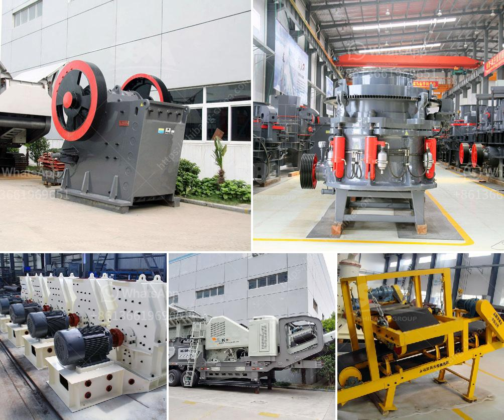

<h3>manganese ore jaw crusher south africa</h3>
Manganese is an essential resource used in various applications, including steel production and battery manufacturing. As one of the leading producers of manganese in the world, South Africa has abundant reserves of manganese ore. However, due to the gradual depletion of these reserves, extracting high-quality manganese ore is becoming increasingly challenging.

To address this issue, the mining industry in South Africa has been investing in advanced technologies to improve the efficiency and effectiveness of manganese ore extraction. One such technology is the manganese ore jaw crusher, which serves as a primary crusher for crushing large chunks of manganese ore.

Traditional jaw crushers are relatively bulky and heavy machines, making them unsuitable for portable operations. Fortunately, a recent technological breakthrough has led to the development of a lightweight and portable jaw crusher. This new crusher allows operators to easily transport and deploy the machine to remote locations, where traditional crushers were not feasible.

The manganese ore jaw crusher South Africa is an important piece of equipment in the manganese ore industry, providing efficient and reliable crushing capabilities for manganese ore particles. It offers advanced features to deliver consistent performance, including high throughput, low energy consumption, and automated operation.

At present, the manganese ore jaw crusher South Africa has two types: one is the PE series jaw crusher, and the other is the CJ series jaw crusher. The PE jaw crusher is usually used as the primary crusher for manganese ore with a size of 0-700mm, while the CJ jaw crusher is used for the primary crusher and secondary crusher stages, crushing all kinds of medium-hardness ores and rocks.

It has always been a highly profitable investment for the manganese ore mining industry in South Africa, thanks to its outstanding durability and high-quality manganese ore jaw crusher. It continues to make a significant contribution to the South African mining industry, as well as worldwide.

In conclusion, manganese ore jaw crusher plays an important role in the manganese ore mining industry in South Africa. As a famous and reliable manganese ore crusher manufacturer, Fote Machinery always regards the quality as the life and customer as the God. If you're interested in the product, please submit your requirements and contacts and then we will contact you in two days. We promise that all your informations won't be leaked to anyone.
<h3>Contact us</h3><ul><li><strong>Whatsapp:&nbsp;<a href="https://wa.me/8613661969651">+8613661969651</a></strong></li><li><a href="https://swt.shibang-china.com/?git&amp;zhl&amp;manganese ore jaw crusher south africa"><strong>Online Service(chat now)</strong></a></li></ul><h3>Related</h3><ul><li><a href='coal crusher machine in zhengzhou henan china.md'>coal crusher machine in zhengzhou henan china</a></li><li><a href='gold mining equipment south africa.md'>gold mining equipment south africa</a></li><li><a href='roller grinding mill vibration.md'>roller grinding mill vibration</a></li><li><a href='copper crusher exporter in south africa.md'>copper crusher exporter in south africa</a></li><li><a href='roller mill diagram.md'>roller mill diagram</a></li></ul>