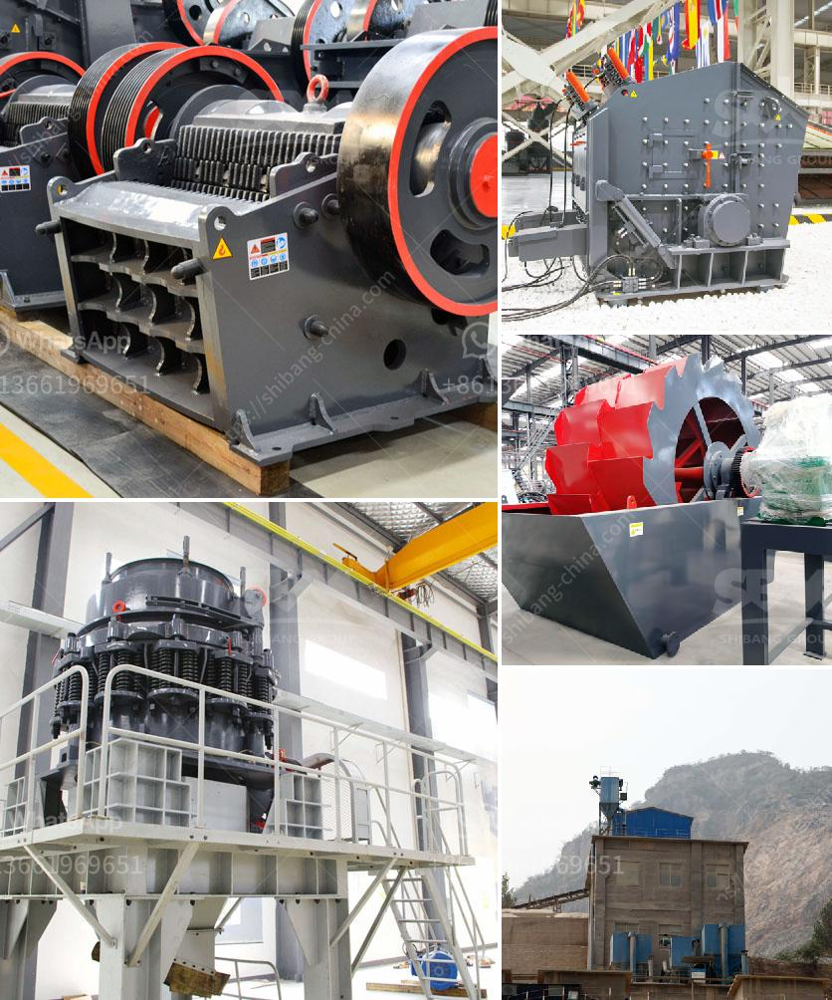

<h3>manufacturer of barite in pakistan</h3>
The barite industry in Pakistan is one of the most promising sectors, as barite is vital to the petroleum exploration industry. Barite, also known as baryte, is a naturally occurring mineral found in various shapes and colors. It is extensively used in the drilling fluid industry as a weighting agent due to its high specific gravity.

Pakistan is blessed with abundant reserves of high-quality barite, found mainly in Balochistan and Khyber Pakhtunkhwa provinces. The country ranks among the top producers globally, making it a key player in the global barite market. The manufacturing of barite involves extraction, purification, and processing to ensure the highest quality for various industries.

One prominent manufacturer and exporter of barite in Pakistan is BME (Pvt.) Ltd., which offers a wide range of grades and high purity levels to meet the requirements of different industries. BME sources its raw material from the mines of Balochistan, ensuring a consistent supply of top-quality barite.

BME has a state-of-the-art production facility equipped with advanced machinery to undertake the extraction and processing of barite. The raw material undergoes a rigorous quality control process to ensure compliance with international standards and client specifications. BME's manufacturing process includes crushing, grinding, and micronizing the barite to achieve the desired particle size.

The company's commitment to quality is evident through its ISO 9001:2015 certification, demonstrating its adherence to strict quality management systems. BME's barite products have gained recognition globally for their high specific gravity, low solubility, and superior performance in drilling fluids.

Besides the petroleum exploration industry, BME's barite products find applications in numerous sectors, including paint and pigment, rubber, plastics, and ceramics. The company's diverse product portfolio caters to the specific needs of each industry, ensuring optimal performance and customer satisfaction.

In addition to manufacturing and exporting barite, BME also offers technical support and consultancy services to its clients. These services include assistance in wellbore design, fluid systems, and barite usage optimization. BME's team of experts provide solutions tailored to the requirements of each customer, promoting efficient and cost-effective operations.

BME's strong commitment to sustainable practices sets it apart from its competitors. The company recognizes the environmental impact associated with barite extraction and processing and takes measures to minimize its carbon footprint. BME ensures responsible mining practices and invests in eco-friendly technologies to reduce the impact on local ecosystems.

As a result of its dedication to quality, innovation, and sustainability, BME has established itself as a reliable manufacturer and exporter of barite in Pakistan. The company's robust presence in the global market has earned it a strong reputation, creating opportunities for growth and expansion.

The barite industry in Pakistan is poised for further development, given the increasing demand for barite in various industries. With manufacturers like BME leading the way, Pakistan is well-positioned to become a major player in the global barite market, contributing to the country's economic growth while maintaining a sustainable approach.
<h3>Contact us</h3><ul><li><strong>Whatsapp:&nbsp;<a href="https://wa.me/8613661969651">+8613661969651</a></strong></li><li><a href="https://swt.shibang-china.com/?git&amp;zhl&amp;manufacturer of barite in pakistan"><strong>Online Service(chat now)</strong></a></li></ul><h3>Related</h3><ul><li><a href='machines de crushine primaires.md'>machines de crushine primaires</a></li><li><a href='clinker plant cost.md'>clinker plant cost</a></li><li><a href='ball mills brands.md'>ball mills brands</a></li><li><a href='how much is limestone per ton.md'>how much is limestone per ton</a></li><li><a href='granite quarry plant in sri lanka.md'>granite quarry plant in sri lanka</a></li></ul>