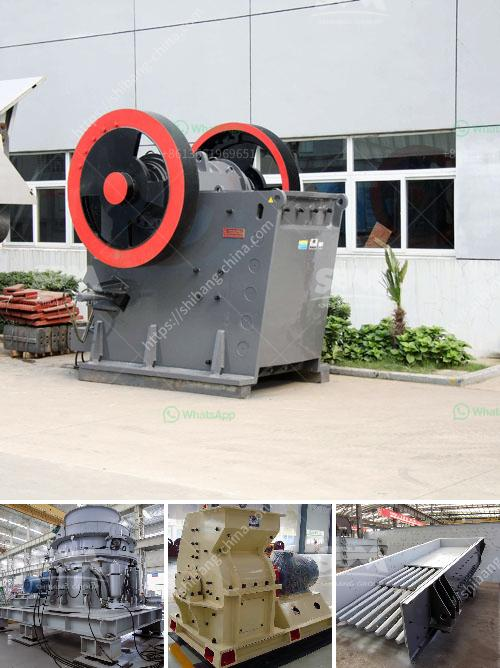

<h3>manufacturer of cement packing plant machine</h3>
Manufacturer Of Cement Packing Plant Machine: An Introduction to Efficient and Reliable Packaging Solutions

In the construction industry, cement is a vital component, acting as the binding agent for various materials. As the demand for cement continues to rise, manufacturers face the challenge of efficiently packaging and distributing their product. To address this need, a specialized manufacturer has emerged, dedicated to producing high-quality cement packing plant machines. This article will explore the functions and benefits of these machines, shedding light on the manufacturer's role in providing efficient and reliable packaging solutions.

A cement packing plant machine serves a crucial role in the cement production process. It is responsible for accurately weighing and packaging cement into bags or bulk containers, ensuring consistency and minimizing wastage. These machines are equipped with advanced technology, allowing for automated operations that enhance productivity while maintaining the quality of the product.

1. Weighing and Filling: The machine is designed to weigh a specific quantity of cement accurately. It ensures that each bag or container is filled with the precise amount, preventing underfilling or wastage due to overfilling.

2. Bag or Container Loading: Once the cement is weighed, the machine efficiently loads it into bags or containers, reducing the need for manual labor. This automation not only saves time but also improves accuracy and eliminates the risk of human error.

3. Sealing and Labeling: The machine includes features for sealing bags airtight, preventing moisture or impurities from compromising the quality of the cement. Additionally, it can apply labels with vital information such as batch numbers, production dates, and logos, ensuring proper identification and traceability.

By investing in a cement packing plant machine from a reputable manufacturer, cement producers can improve their packaging process and reap numerous benefits:

1. Increased Efficiency: The automated operations of these machines significantly reduce human labor requirements, allowing manufacturers to streamline their production lines. This, in turn, leads to higher output rates and better utilization of resources.

2. Consistency and Accuracy: The precision of the machine's weighing and filling mechanisms ensures uniformity in cement packaging, maintaining quality standards across all bags or containers produced. This consistency enhances customer satisfaction and enhances the reputation of manufacturers, increasing trust in their products.

3. Waste Reduction: The precise weighing capabilities of the machine minimize the risk of overfilling or underfilling bags. This not only saves costs associated with excessive cement consumption but also contributes to sustainability efforts by reducing wastage.

4. Improved Safety: The automation provided by these machines eliminates the need for manual labor, thereby minimizing the risk of accidents or injuries associated with heavy lifting. Manufacturers can create a safer working environment for their employees by investing in these advanced packaging solutions.

The manufacturer of cement packing plant machines plays a pivotal role in the construction industry, enabling efficient and reliable packaging solutions for cement producers. The advanced technology and automation embedded in these machines enhance productivity, consistency, and accuracy, while also reducing waste and improving workplace safety. By selecting a reputable manufacturer, cement producers can obtain a high-quality machine that meets their packaging needs, ensuring the seamless distribution of their cement and contributing to the growth and sustainability of the construction sector.
<h3>Contact us</h3><ul><li><strong>Whatsapp:&nbsp;<a href="https://wa.me/8613661969651">+8613661969651</a></strong></li><li><a href="https://swt.shibang-china.com/?git&amp;zhl&amp;manufacturer of cement packing plant machine"><strong>Online Service(chat now)</strong></a></li></ul><h3>Related</h3><ul><li><a href='manufacturer of jaw crusher.md'>manufacturer of jaw crusher</a></li><li><a href='used jaw crushers for sale in florida.md'>used jaw crushers for sale in florida</a></li><li><a href='small used jaw crusher ebay.md'>small used jaw crusher ebay</a></li><li><a href='used cement clinker grinding plant.md'>used cement clinker grinding plant</a></li><li><a href='equipment needed for small scale mining in zimbabwe.md'>equipment needed for small scale mining in zimbabwe</a></li></ul>