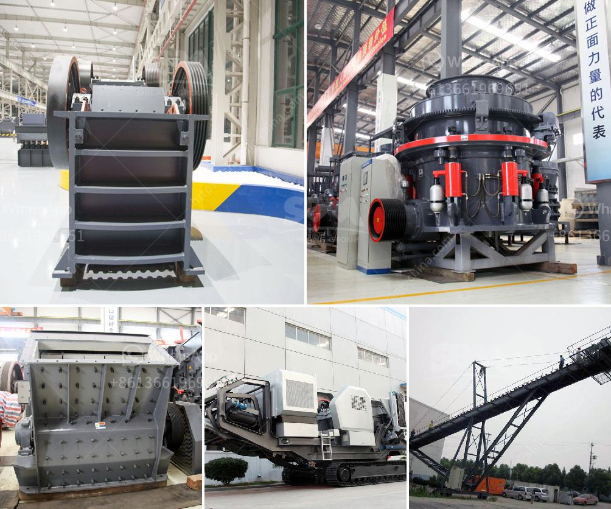

<h3>manufacturer of crusher plant of bajri from rajkot</h3>
In the world of construction, crushed stones are an essential ingredient used for various purposes. Whether it's for building roads, constructing buildings, or any other major infrastructure projects, high-quality crushed stones are required to ensure durability and strength. And when it comes to producing these stones, the manufacturer of crusher plants plays a significant role. 

One such prominent manufacturer of crusher plants in the city of Rajkot is leading the way in stone crushing technology – ensuring that the construction industry has access to top-quality crushed stones. This company has been providing its services for several years and has gained a reputation for its commitment to excellence, innovation, and customer satisfaction.

The crusher plants manufactured by this company are designed to efficiently break down large rocks into smaller sizes according to the required specifications. These plants are equipped with robust crushers that use high-pressure force to crush stones effectively. The crushed stones produced are of uniform size and shape, making them ideal for various construction applications.

The manufacturer of crusher plants in Rajkot uses advanced technology and machinery to ensure the highest production capacity while maintaining strict quality control. The plants are designed to be energy-efficient, thereby reducing operating costs and minimizing environmental impact. Safety features are also integrated into the designs to ensure a safe working environment for the operators.

Moreover, this manufacturer understands the diverse needs of the construction industry and offers a range of crusher plants catering to different requirements. Whether it's a small-scale project or a large-scale infrastructure development, they have the right solution to match the needs of their clients.

In addition to manufacturing crusher plants, this company also provides comprehensive after-sales service, including installation, maintenance, and spare parts support. Their dedicated team of professionals is always ready to assist customers and ensure smooth operations of the crusher plants.

The manufacturer of crusher plants of Bajri from Rajkot is committed to excellence and is constantly investing in research and development to stay ahead in the stone crushing industry. By incorporating the latest technological advancements, they aim to provide the construction industry with efficient, reliable, and sustainable solutions.

In conclusion, with its commitment to excellence, innovation, and customer satisfaction, the manufacturer of crusher plants in Rajkot is leading the way in stone crushing technology. Their high-quality and efficient crusher plants ensure that the construction industry has access to top-quality crushed stones for various applications. With a strong focus on customer service and continuous improvement, this company is certainly a preferred choice for any construction project requiring crushed stones in Rajkot and beyond.
<h3>Contact us</h3><ul><li><strong>Whatsapp:&nbsp;<a href="https://wa.me/8613661969651">+8613661969651</a></strong></li><li><a href="https://swt.shibang-china.com/?git&amp;zhl&amp;manufacturer of crusher plant of bajri from rajkot"><strong>Online Service(chat now)</strong></a></li></ul><h3>Related</h3><ul><li><a href='coal crusher machine in zhengzhou henan china.md'>coal crusher machine in zhengzhou henan china</a></li><li><a href='crushed limestone for sale.md'>crushed limestone for sale</a></li><li><a href='piedra maquinaria agregada equipos de bolivia.md'>piedra maquinaria agregada equipos de bolivia</a></li><li><a href='vibrating screen price philippines.md'>vibrating screen price philippines</a></li><li><a href='stone crusher in uk.md'>stone crusher in uk</a></li></ul>