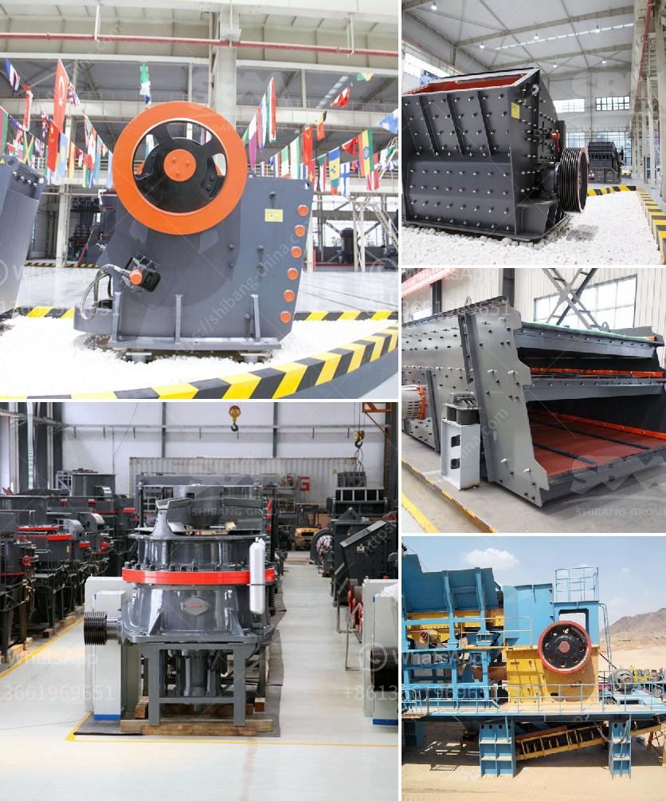

<h3>manufacturer of jaw crusher</h3>
A jaw crusher is a primary crusher that is used for crushing hard and abrasive materials. It is widely used in the mining and construction industry because of its ability to crush large pieces of material and reduce down to smaller sizes for further processing.

When looking for a jaw crusher manufacturer, it is essential to find one that offers high-quality equipment backed by exceptional customer service. A reputable manufacturer will have a strong track record and a solid reputation in the industry.

One such manufacturer is XYZ Crushers, which has been in the business for over two decades. XYZ Crushers is known for its reliable and durable jaw crushers that are designed to withstand the toughest conditions. Their machines are made with high-quality materials and undergo rigorous testing to ensure they meet stringent industry standards.

XYZ Crushers offers a wide range of jaw crushers, from small portable units suitable for small-scale operations to large stationary crushers for high-capacity mining applications. Their jaw crushers are highly versatile and can be used for various types of materials, including limestone, granite, basalt, river gravel, and even hard rock.

One of the key features of XYZ Crushers' jaw crushers is their ease of maintenance. The machines are designed with accessibility in mind, with easy-to-replace wear parts and a simplified maintenance process. This reduces downtime and increases productivity, saving time and money for the operator.

In addition to excellent equipment, XYZ Crushers provides exceptional customer service. Their team of experts is available to assist customers with any queries or technical support they may require. XYZ Crushers also offers on-site training and installation support to ensure their customers get the most out of their jaw crushers.

In conclusion, when considering a manufacturer for a jaw crusher, it is crucial to choose one that offers high-quality equipment, durability, and excellent customer service. XYZ Crushers ticks all these boxes and more, making them a reliable choice for anyone in need of a jaw crusher.
<h3>Contact us</h3><ul><li><strong>Whatsapp:&nbsp;<a href="https://wa.me/8613661969651">+8613661969651</a></strong></li><li><a href="https://swt.shibang-china.com/?git&amp;zhl&amp;manufacturer of jaw crusher"><strong>Online Service(chat now)</strong></a></li></ul><h3>Related</h3><ul><li><a href='ball mill grinding.md'>ball mill grinding</a></li><li><a href='cement plant production line.md'>cement plant production line</a></li><li><a href='second hand gold mining equipments in uk.md'>second hand gold mining equipments in uk</a></li><li><a href='vibrating screen price philippines.md'>vibrating screen price philippines</a></li><li><a href='rock crushers for sale ghana.md'>rock crushers for sale ghana</a></li></ul>