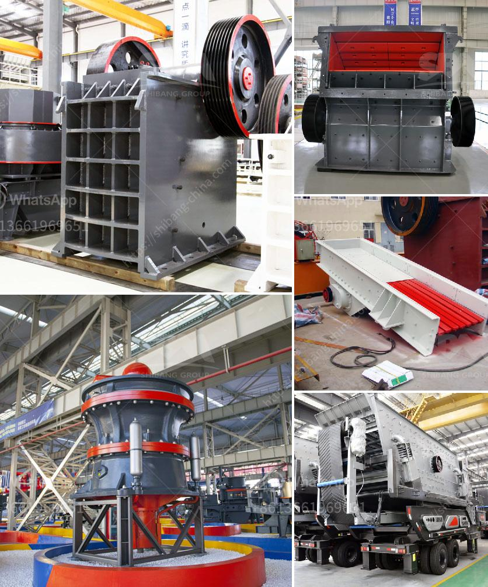

<h3>manufacturer of quartz powder in karnataka</h3>
The state of Karnataka in India is renowned for its rich reserves of various minerals, including quartz. Quartz is a highly versatile and widely used mineral, known for its unique properties and numerous applications in various industries. Being a key component in several industrial processes, the demand for quartz powder remains consistently high. This has led to the emergence of several manufacturers of quartz powder in Karnataka.

One prominent manufacturer of quartz powder in Karnataka is XYZ Minerals Pvt. Ltd. With years of experience and expertise in the mining and processing of quartz, XYZ Minerals has established itself as a reliable player in the industry. The company operates state-of-the-art facilities that adhere to strict quality control measures to ensure the production of high-quality quartz powder.

XYZ Minerals sources quartz from its own mines located in the mineral-rich regions of Karnataka. The raw quartz is carefully extracted and undergoes a series of processes, including crushing, grinding, and screening, to obtain the final quartz powder. The company possesses advanced machinery and equipment that enable efficient processing and manufacturing of a diverse range of quartz powder grades.

The quartz powder manufactured by XYZ Minerals finds extensive applications in various industries. It is used as a filler in the production of paints, rubber, and plastics due to its high chemical and thermal resistance. Moreover, it is widely employed in the manufacturing of glass, ceramics, and construction materials. The consistent quality of the quartz powder produced by XYZ Minerals has garnered accolades from customers across these industries.

What sets XYZ Minerals apart from its competitors is its commitment to environmental sustainability. The company adheres to strict environmental regulations and practices responsible mining. They have implemented measures to minimize environmental impact during the extraction and processing of quartz. XYZ Minerals actively engages in reforestation, conservation of water resources, and sustainable land use practices.

In conclusion, Karnataka is home to several reputable manufacturers of quartz powder, and XYZ Minerals Pvt. Ltd. is one such prominent player in the market. The company's commitment to quality, technological prowess, and sustainable practices has positioned it as a reliable supplier in the industry. With the ever-increasing demand for quartz powder, XYZ Minerals continues to contribute significantly to the industrial sector in Karnataka and beyond.
<h3>Contact us</h3><ul><li><strong>Whatsapp:&nbsp;<a href="https://wa.me/8613661969651">+8613661969651</a></strong></li><li><a href="https://swt.shibang-china.com/?git&amp;zhl&amp;manufacturer of quartz powder in karnataka"><strong>Online Service(chat now)</strong></a></li></ul><h3>Related</h3><ul><li><a href='construction equipment manufacturer in turkey.md'>construction equipment manufacturer in turkey</a></li><li><a href='buy fine grinding machine.md'>buy fine grinding machine</a></li><li><a href='companies that sell conveyor belts.md'>companies that sell conveyor belts</a></li><li><a href='washing process for silica sand.md'>washing process for silica sand</a></li><li><a href='sayaji jaw crusher vadodara.md'>sayaji jaw crusher vadodara</a></li></ul>