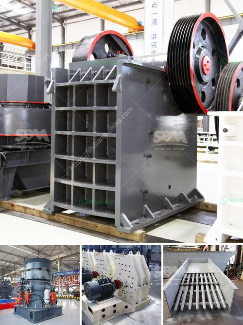

<h3>manufacturers and supplyers of quarry equipment</h3>
Manufacturers and Suppliers of Quarry Equipment: Ensuring the Efficiency and Safety of Your Operations

The quarrying industry is one of the oldest and most essential sectors in the world. The process of extracting valuable minerals or other geological materials from the earth requires the use of heavy machinery, vehicles, and equipment. These indispensable tools make quarrying operations more efficient, productive, and safer.

However, sourcing the right equipment for your quarrying needs can be a daunting task. With the multitude of options available in the market, it is crucial to choose reliable manufacturers and suppliers who can provide top-quality, durable, and cost-effective machinery. In this article, we will explore the importance of partnering with reputable manufacturers and suppliers in the quarry equipment industry.

Manufacturers are the heart of the quarry equipment industry. They design, engineer, and produce machinery specifically tailored to meet the unique demands and challenges of quarrying operations. These manufacturers have deep expertise and decades of experience in the quarrying field, ensuring that the equipment meets the highest standards of performance, efficiency, and reliability.

One of the key aspects of quarry equipment is safety. Manufacturers prioritize the incorporation of advanced safety features and technologies into their machinery. They understand the potentially hazardous nature of quarrying activities and strive to minimize risks for workers on site. Safety features such as emergency stop buttons, proximity sensors, and integrated warning systems are just a few examples of the measures taken to protect workers' well-being.

Moreover, manufacturers invest heavily in research and development to continually improve their equipment's efficiency. They are committed to reducing fuel consumption, emissions, and operational costs. By embracing innovative technologies, manufacturers can offer equipment with enhanced fuel efficiency and reduced environmental impact. This not only benefits the quarrying company's bottom line but also contributes to sustainability efforts.

While manufacturers play a crucial role in providing high-quality quarry equipment, suppliers are equally important. Suppliers act as the middlemen between the manufacturers and the quarrying companies. They are responsible for distributing the equipment, spare parts, and maintenance services to their customers.

Choosing the right supplier is crucial to ensure a seamless procurement process and maintenance support. Reliable suppliers have a proven track record of supplying genuine parts and accessories, ensuring that the equipment operates at its optimal capacity. They also offer after-sales services, including routine maintenance and repairs, to minimize downtime and maximize productivity.

In addition to equipment distribution, suppliers can also provide valuable insights and consultations when selecting the appropriate machinery for specific quarrying needs. Their in-depth knowledge of the industry and close relationships with manufacturers enable them to offer tailored solutions and assist in making informed decisions.

In conclusion, the quarry equipment industry relies on the expertise and collaboration of manufacturers and suppliers. Manufacturers design and produce top-quality equipment to meet the specific demands of quarrying operations, prioritizing safety and efficiency. On the other hand, suppliers act as the link between manufacturers and quarrying companies, ensuring smooth distribution, maintenance support, and personalized consultations. By partnering with reputable manufacturers and suppliers, quarrying companies can optimize their operations, streamline their procurement processes, and enhance workplace safety.
<h3>Contact us</h3><ul><li><strong>Whatsapp:&nbsp;<a href="https://wa.me/8613661969651">+8613661969651</a></strong></li><li><a href="https://swt.shibang-china.com/?git&amp;zhl&amp;manufacturers and supplyers of quarry equipment"><strong>Online Service(chat now)</strong></a></li></ul><h3>Related</h3><ul><li><a href='barite powder processing plant process.md'>barite powder processing plant process</a></li><li><a href='tertiary impact crushers.md'>tertiary impact crushers</a></li><li><a href='coal crusher rental price list.md'>coal crusher rental price list</a></li><li><a href='mobile sand washing machine.md'>mobile sand washing machine</a></li><li><a href='gypsum crushing process.md'>gypsum crushing process</a></li></ul>