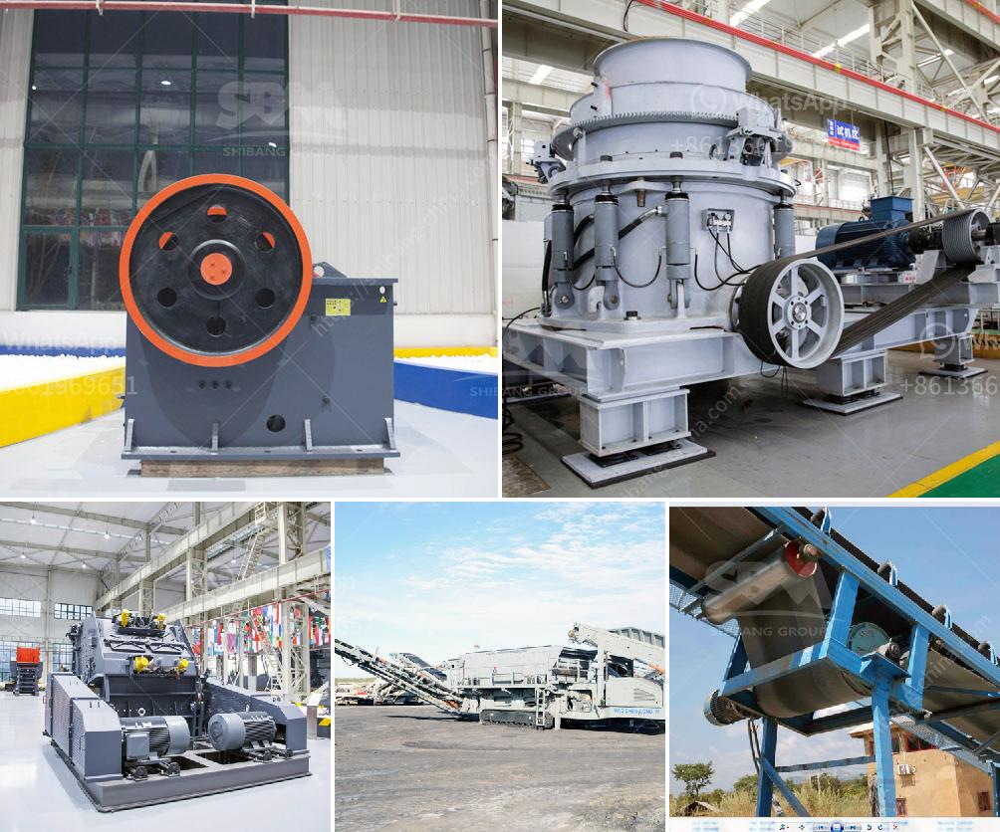

<h3>manufacturing cost of 6mm rolling mill</h3>
The manufacturing cost of a 6mm rolling mill is a crucial factor to consider when investing in machinery for metalworking purposes. The cost of manufacturing such equipment depends on various factors, including the materials used, production processes, labor costs, and overhead expenses. In this article, we will explore the manufacturing cost of a 6mm rolling mill and discuss the factors that contribute to this expense.

The first factor that affects the manufacturing cost of a 6mm rolling mill is the choice of materials. Rolling mills are typically constructed with sturdy materials such as steel or cast iron to ensure durability and longevity. The cost of these materials will depend on market prices and the quantity needed for the production of each mill.

Additionally, the production processes used in manufacturing the rolling mill can influence its cost. Various steps, such as casting, forging, machining, and assembling, are involved in the production of a rolling mill. Each of these processes contributes to the overall manufacturing cost, as they require skilled labor, specialized equipment, and energy consumption.

Labor costs play a significant role in determining the manufacturing cost of a rolling mill. Skilled labor is required for operating machinery, performing quality checks, and assembling the components. The labor cost will depend on factors such as the location of the manufacturing facility and the skill level of the workers involved in the production process.

Overhead expenses, including rent, utilities, and administrative costs, also contribute to the manufacturing cost. The size of the manufacturing facility, its location, and the complexity of production operations influence these overhead expenses. These costs are typically calculated on a per-unit basis and added to the total manufacturing cost.

Moreover, the technology and automation employed in the manufacturing process can impact the cost of a 6mm rolling mill. Automation can streamline production, reduce labor requirements, and improve efficiency. However, the initial investment in automated machinery may increase the manufacturing cost. Manufacturers must carefully balance the application of automation to achieve cost-effectiveness without compromising product quality.

The production volume also affects the manufacturing cost per unit. Higher production volumes allow for economies of scale, where the cost per unit decreases as production increases. Manufacturers may offer discounts for bulk orders, which can reduce the overall cost for customers.

The manufacturing cost of a 6mm rolling mill can vary significantly depending on the aforementioned factors. It is crucial for manufacturers to analyze each element carefully to ensure competitive pricing while maintaining profitability. Market research, cost optimization strategies, and efficient production planning play an essential role in determining the final pricing of the equipment.

In conclusion, the manufacturing cost of a 6mm rolling mill is influenced by various factors, including the choice of materials, production processes, labor costs, and overhead expenses. Manufacturers must carefully consider each element to determine the most cost-effective pricing for their products while maintaining quality and profitability. By utilizing advanced technology, employing skilled labor, and optimizing production processes, manufacturers can strive to offer competitive prices without compromising on the performance and durability of the rolling mill.
<h3>Contact us</h3><ul><li><strong>Whatsapp:&nbsp;<a href="https://wa.me/8613661969651">+8613661969651</a></strong></li><li><a href="https://swt.shibang-china.com/?git&amp;zhl&amp;manufacturing cost of 6mm rolling mill"><strong>Online Service(chat now)</strong></a></li></ul><h3>Related</h3><ul><li><a href='materials for assembling a stone crusher.md'>materials for assembling a stone crusher</a></li><li><a href='stone crusher plant in ghana.md'>stone crusher plant in ghana</a></li><li><a href='best jaw crusher for making stone.md'>best jaw crusher for making stone</a></li><li><a href='china stone grinding mill.md'>china stone grinding mill</a></li><li><a href='crusher for sale egypt.md'>crusher for sale egypt</a></li></ul>