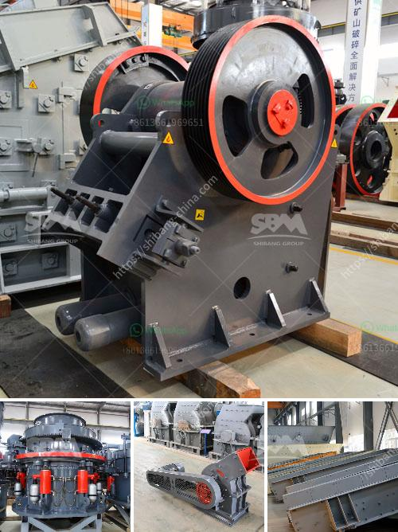

<h3>manufacturing of marble and granite crusher machines</h3>
Marble and granite are natural resources that have been used for centuries in construction and art. Both stones are incredibly durable and have a beautiful appearance, which makes them popular choices for various applications. However, before they can be used in buildings or sculptures, the raw materials need to be processed into smaller sizes. This is where marble and granite crusher machines come into play.

Manufacturing of these machines involves a series of processes, starting with the design and development of the equipment. Once the concept is established, engineers use computer-aided design (CAD) software to create a detailed 3D model. This model is then used to build a prototype, which undergoes rigorous testing to ensure its efficiency and reliability.

Once the prototype passes all tests, the manufacturing phase begins. This involves sourcing high-quality materials to construct the machine's components. The frame is usually made from sturdy steel, which provides the necessary support for the crushing mechanism. Other components, such as the feed hopper, crushing chamber, and discharge chute, are typically made of durable materials like stainless steel to withstand the harsh conditions of the crushing process.

The actual crushing mechanism consists of a set of rotating blades or hammers that grind the marble or granite into smaller pieces. These blades or hammers are powered by an electric motor or hydraulic system, depending on the design of the machine. The crushed material is then transported through a conveyor belt or chute for further processing or storage.

Safety features are an essential aspect of manufacturing these machines to protect the operators and prevent accidents. For example, most crushers will have emergency stop buttons and guards to prevent accidental contact with the rotating blades or hammers.

In conclusion, the manufacturing of marble and granite crusher machines involves a meticulous process that ensures the durability, efficiency, and safety of the equipment. These machines play a vital role in the processing of marble and granite materials, allowing for their use in various applications, from construction to art.
<h3>Contact us</h3><ul><li><strong>Whatsapp:&nbsp;<a href="https://wa.me/8613661969651">+8613661969651</a></strong></li><li><a href="https://swt.shibang-china.com/?git&amp;zhl&amp;manufacturing of marble and granite crusher machines"><strong>Online Service(chat now)</strong></a></li></ul><h3>Related</h3><ul><li><a href='gypsum powder plant india.md'>gypsum powder plant india</a></li><li><a href='used clay grinder for sale in tamilnadu.md'>used clay grinder for sale in tamilnadu</a></li><li><a href='ball mill grinding.md'>ball mill grinding</a></li><li><a href='calcium carbonate micronized plants.md'>calcium carbonate micronized plants</a></li><li><a href='crushing machine in quarry.md'>crushing machine in quarry</a></li></ul>