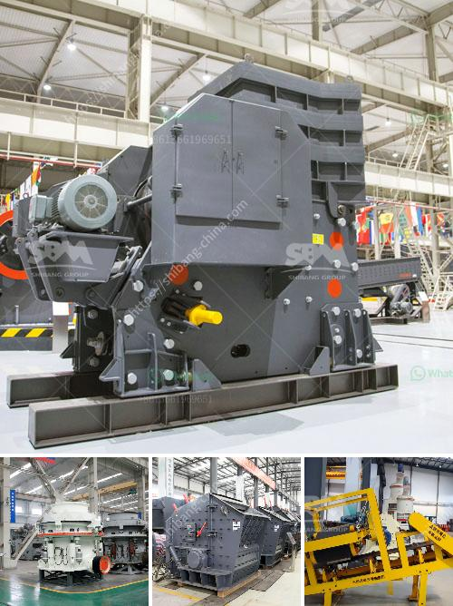

<h3>manufacturing process of plaster of paris china</h3>
Plaster of Paris, also known as gypsum plaster or simply plaster, is a versatile material used in a variety of applications, including construction, art, and medicine. It is widely used for creating molds, sculptures, and decorative elements due to its excellent workability and ability to set quickly. When it comes to manufacturing plaster of Paris china, a specific process must be followed to produce high-quality and durable products.

The manufacturing process of plaster of Paris china begins with the extraction of gypsum from natural deposits. Gypsum is a mineral composed of calcium sulfate dihydrate (CaSO4·2H2O), which is ground into a fine powder. The extracted gypsum is then heated in an oven at around 150 degrees Celsius to remove any moisture content.

Once the gypsum is completely dehydrated, it is crushed into small particles and mixed with water to form a slurry. The slurry is carefully monitored to ensure the correct consistency for molding. Various additives, such as accelerators or retarders, may be included in the slurry to control the setting time or improve certain properties of the final product.

Next, the slurry is poured into specific molds. These molds are usually made of plaster or silicone rubber, allowing intricate detailing and complex shapes to be achieved. It is important to carefully fill the molds without leaving any air bubbles.

After pouring the slurry into the molds, it undergoes a setting process. The water in the slurry reacts with the calcium sulfate hemihydrate (CaSO4·0.5H2O) in the gypsum, causing it to harden. This hydration process is exothermic, meaning it releases heat. The set gypsum solidifies within minutes, forming a solid and rigid structure.

Once the plaster has hardened, the molds are opened, and the semi-finished plaster of Paris china is carefully removed. It is crucial to handle the delicate plaster products with care to avoid any damage. The semi-finished china is then allowed to dry at room temperature for several days to ensure complete dehydration and enhanced strength.

After drying, the plaster of Paris china enters the finishing phase. Skilled craftsmen and artisans meticulously inspect the products, removing any imperfections or rough edges. The china may also undergo additional treatments, such as sanding, polishing, or glazing, to achieve the desired aesthetic and functional properties.

Finally, the finished plaster of Paris china products are carefully packaged to prevent any breakage during transportation. They are then ready to be shipped to various industries, including art studios, construction companies, and medical facilities.

In conclusion, the manufacturing process of plaster of Paris china involves extracting gypsum, dehydrating it, and mixing it with water to create a slurry. This slurry is poured into molds and left to set, forming a solid structure. After careful removal from the molds and drying, the plaster china undergoes finishing treatments before being packaged and transported. This intricate process ensures the production of high-quality and versatile plaster of Paris china, ready to be used in numerous applications.
<h3>Contact us</h3><ul><li><strong>Whatsapp:&nbsp;<a href="https://wa.me/8613661969651">+8613661969651</a></strong></li><li><a href="https://swt.shibang-china.com/?git&amp;zhl&amp;manufacturing process of plaster of paris china"><strong>Online Service(chat now)</strong></a></li></ul><h3>Related</h3><ul><li><a href='ball mill pulverizer price.md'>ball mill pulverizer price</a></li><li><a href='mining crusher machines in selling in kenya.md'>mining crusher machines in selling in kenya</a></li><li><a href='sale 42 jaw crusher in india.md'>sale 42 jaw crusher in india</a></li><li><a href='jual grinding roll mill.md'>jual grinding roll mill</a></li><li><a href='used aggregate crusher for sale in india.md'>used aggregate crusher for sale in india</a></li></ul>