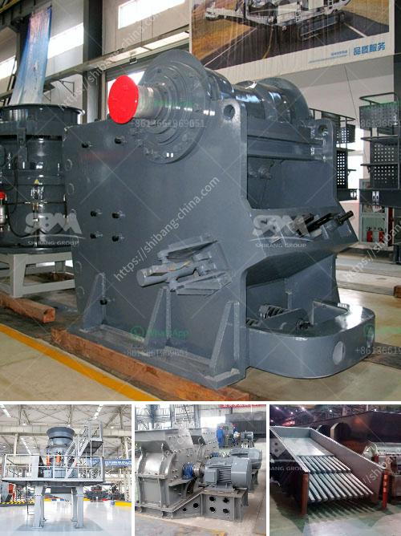

<h3>marble crusher manufacturer</h3>
Marble, being crushed into small fragments, is becoming widely used for its versatility in various domestic and industrial applications. The marble industry is accelerating at a rapid pace and witnessing drastic changes with the emergence of advanced crushers. These crushers are ideal for processing marble, as they come with high precision engineering and have a reputation for delivering consistent performance.

One such marble crusher manufacturer is a pioneer in the industry, offering an extensive range of crushing and screening solutions. Utilizing state-of-the-art technology and enhanced manufacturing techniques, their marble crushers are at the forefront of crushing innovation. With a focus on providing exceptional quality and maximizing productivity, they have established themselves as a market leader.

The primary objective of any marble crusher manufacturer is to develop crushers that can efficiently process the material while minimizing the environmental impact. Therefore, these manufacturers are investing heavily in research and development to create crushers that are eco-friendly, energy-efficient, and can operate with minimal noise and dust emissions.

Another crucial aspect of the marble crusher manufacturing process is to ensure the equipment's durability and long service life. These manufacturers prioritize heavy-duty construction and use high-quality materials to withstand the demanding conditions encountered during marble crushing operations. By employing advanced structural designs and reinforced components, their crushers can reliably handle the toughest marble crushing tasks without frequent maintenance or breakdowns.

In addition to durability, safety is a paramount concern for marble crusher manufacturers. They adhere to stringent safety standards and integrate various safety features into their equipment designs. Such features include advanced control systems, emergency stop buttons, and safety guards to protect the operators and prevent accidents.

As a leading marble crusher manufacturer, they also emphasize the importance of customization. Each customer's requirements may vary in terms of desired output, feed size, and other specifications. To address this, they offer a range of crushers with different capacities and configurations. By providing tailored solutions, they ensure customers can achieve optimal results and meet their unique processing needs.

Furthermore, these manufacturers understand the significance of after-sales support and customer service. They have established a robust network of service centers and customer support teams to provide timely assistance, perform regular maintenance, and address any issues that may arise during the usage of their crushers. This commitment to customer satisfaction has earned them a loyal clientele and a strong reputation in the industry.

In conclusion, the marble crusher industry is witnessing remarkable advancements and the emergence of innovative crushing solutions. Marble crusher manufacturers are at the forefront of this development, offering eco-friendly, durable, and efficient crushers. Their commitment to optimizing productivity, ensuring safety, and providing customized solutions has propelled them to the top of the industry. As the demand for crushed marble continues to grow, these manufacturers will continue driving the industry forward, pushing the boundaries of crushing technology.
<h3>Contact us</h3><ul><li><strong>Whatsapp:&nbsp;<a href="https://wa.me/8613661969651">+8613661969651</a></strong></li><li><a href="https://swt.shibang-china.com/?git&amp;zhl&amp;marble crusher manufacturer"><strong>Online Service(chat now)</strong></a></li></ul><h3>Related</h3><ul><li><a href='jual beli stone crusher bekas.md'>jual beli stone crusher bekas</a></li><li><a href='ball mill grinding.md'>ball mill grinding</a></li><li><a href='manufacturing cost of 6mm rolling mill.md'>manufacturing cost of 6mm rolling mill</a></li><li><a href='india second hand ball mill for sale.md'>india second hand ball mill for sale</a></li><li><a href='horizontal stone ball mill.md'>horizontal stone ball mill</a></li></ul>