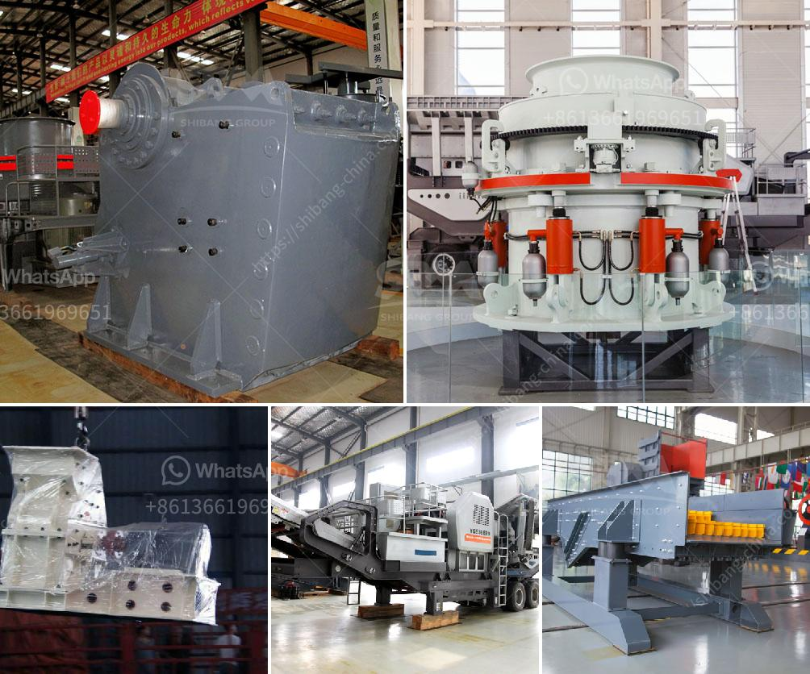

<h3>marble grinding machine dealers</h3>
Marble grinding machine dealers are abundant in the market. They play a crucial role in the marble industry, as they provide access to equipment that enables businesses to enhance the quality of their marble products. These dealers specialize in supplying marble grinding machines that are efficient, durable, and capable of delivering outstanding results.

Marble grinding machines are widely used in various industries, such as construction, architecture, and interior design. They are utilized for grinding and polishing marble surfaces, transforming them into stunning and glossy masterpieces. These machines are incredibly powerful and can grind down even the toughest of marble surfaces, leaving behind a smooth and flawless finish.

When searching for marble grinding machine dealers, it is essential to consider several factors. Firstly, one must assess the reputation and experience of the dealer. A reputable and experienced dealer will have a track record of providing high-quality products and excellent customer service. They will possess in-depth knowledge about marble grinding machines and will be able to guide customers in selecting the most suitable equipment for their specific needs.

Additionally, one should look for a dealer who offers a wide range of marble grinding machines. Different projects and budgets may require different types of machines. Therefore, a dealer with a diverse inventory will allow customers to choose from multiple options. This will ensure that businesses can find the perfect machine that meets their requirements in terms of capacity, power, and price.

Furthermore, it is important to consider the after-sales support provided by the dealer. Marble grinding machines can be complex and require proper maintenance and servicing. A reputable dealer should offer assistance with installation, training, and troubleshooting should any issues arise. They should also provide warranty options to give customers peace of mind and protect their investment.

In addition to these considerations, it is equally important to compare prices offered by different dealers. While price is a crucial factor, it should not be the sole determining factor. Quality and customer service should also be taken into account. Cheaper machines may not have the same build quality or durability compared to more expensive options. Therefore, it is advisable to strike a balance between price and quality when selecting a machine.

In conclusion, marble grinding machine dealers are integral to the marble industry. They provide access to high-quality machines that enable businesses to enhance the appearance and quality of their marble products. When choosing a dealer, it is essential to consider their reputation, experience, range of machines, after-sales support, and pricing. By doing so, businesses can find a reliable partner who can supply them with the right equipment to achieve stunning and flawless marble finishes.
<h3>Contact us</h3><ul><li><strong>Whatsapp:&nbsp;<a href="https://wa.me/8613661969651">+8613661969651</a></strong></li><li><a href="https://swt.shibang-china.com/?git&amp;zhl&amp;marble grinding machine dealers"><strong>Online Service(chat now)</strong></a></li></ul><h3>Related</h3><ul><li><a href='raymond mill technical specification.md'>raymond mill technical specification</a></li><li><a href='machine de fabrication de sable de platre.md'>machine de fabrication de sable de platre</a></li><li><a href='vertical mill working principle of the hydraulic.md'>vertical mill working principle of the hydraulic</a></li><li><a href='secondary crushing cone crusher drawings.md'>secondary crushing cone crusher drawings</a></li><li><a href='calcium carbonate powder making.md'>calcium carbonate powder making</a></li></ul>