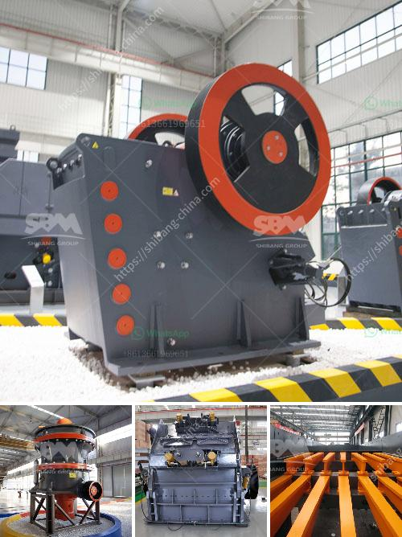

<h3>marble mining equipment manufacturers</h3>
Marble mining has been one of the key industries in the world, dating back to ancient times. The widespread availability of deposits and the unique aesthetic appeal of marble have made it a popular choice in construction, sculpture, and design. Marble mining requires extensive equipment, machinery, and skilled laborers to extract and refine the stone. In this article, we will highlight some of the top manufacturers of marble mining equipment.

Caterpillar is a well-known manufacturer of mining equipment that offers a wide range of machinery for marble mining. Their equipment includes bulldozers, wheel loaders, and articulated dump trucks. With over 95 years of experience in the industry, Caterpillar has become a global leader in providing reliable and durable equipment for marble mining operations.

Komatsu is another prominent manufacturer that specializes in mining equipment, including machinery for marble extraction. Their range of products includes hydraulic excavators, rigid dump trucks, and motor graders. With a focus on innovation and sustainability, Komatsu aims to provide efficient and eco-friendly solutions for the mining industry.

Atlas Copco is a leading manufacturer of drilling equipment used in marble mining. They offer a wide range of drilling rigs, including surface and underground models. Atlas Copco's drilling equipment is known for its high performance, precision, and durability, making it a popular choice among marble mining companies worldwide.

Hitachi Construction Machinery is a global manufacturer of mining equipment that provides a comprehensive range of machinery for marble mining. Their products include hydraulic excavators, dump trucks, and wheel loaders. Hitachi's equipment is known for its advanced technology, efficiency, and reliability, ensuring smooth and productive operations in marble mines.

Sandvik is a renowned manufacturer of mining equipment, offering a wide range of products for marble mining. Their solutions include drilling equipment, rock tools, and crushing and screening machinery. Sandvik's equipment is known for its high-quality construction, performance, and safety features, making it a popular choice among marble mining companies.

In conclusion, marble mining requires specialized equipment to extract and refine the stone efficiently. Several manufacturers provide a wide range of machinery for marble mining operations, including Caterpillar Inc., Komatsu Ltd., Atlas Copco, Hitachi Construction Machinery Co., Ltd, and Sandvik Mining and Rock Technology. These manufacturers offer reliable, durable, and innovative equipment that enables efficient and sustainable marble mining. With their expertise and technology, they play a crucial role in the growth and development of the marble mining industry globally.
<h3>Contact us</h3><ul><li><strong>Whatsapp:&nbsp;<a href="https://wa.me/8613661969651">+8613661969651</a></strong></li><li><a href="https://swt.shibang-china.com/?git&amp;zhl&amp;marble mining equipment manufacturers"><strong>Online Service(chat now)</strong></a></li></ul><h3>Related</h3><ul><li><a href='cost of setting up a cement plant in usa.md'>cost of setting up a cement plant in usa</a></li><li><a href='chrome crusher for sale south africa.md'>chrome crusher for sale south africa</a></li><li><a href='rent a conveyor belts singapur.md'>rent a conveyor belts singapur</a></li><li><a href='manufacturer of cement packing plant machine.md'>manufacturer of cement packing plant machine</a></li><li><a href='iron ore beneficiation plant consultants in india.md'>iron ore beneficiation plant consultants in india</a></li></ul>