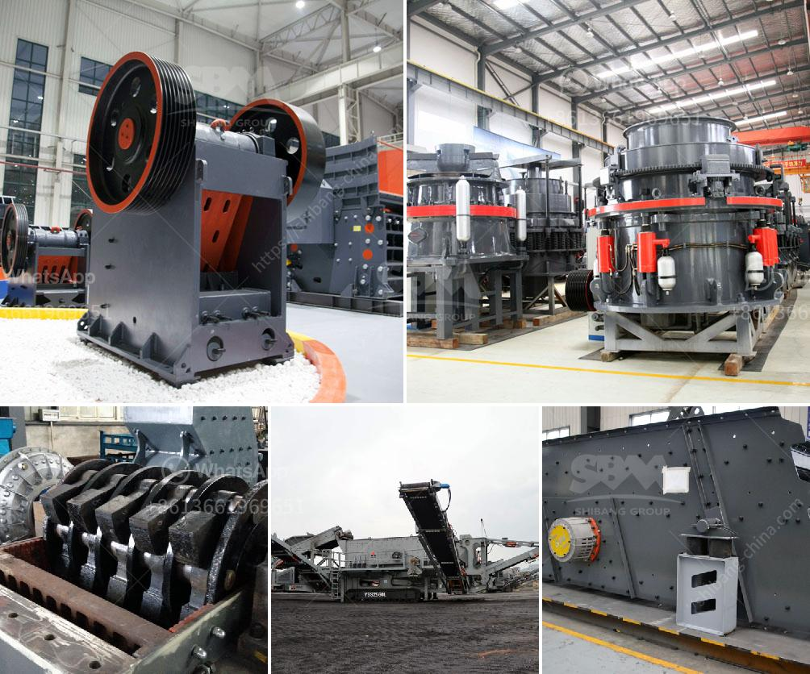

<h3>marble powder plant price pakistan</h3>
Marble is one of the commonly used building materials in Pakistan. It is a versatile stone that comes in various colors, patterns, and textures. However, due to its porous nature, marble can easily get stained and damaged. To enhance its durability and longevity, marble is often polished and coated with a protective layer. This process requires the use of marble powder, which is obtained by crushing and grinding marble rocks.

The use of marble powder in various industrial applications has led to its increased demand worldwide. In Pakistan, the marble powder industry is at its peak, contributing significantly to the country's economy. A number of marble powder plants have emerged and are supplying high-quality marble powder to various industries at competitive prices.

The price of marble powder depends on several factors such as its quality, color, availability, and packaging. In Pakistan, the marble powder is mainly available in two forms: white marble powder and yellow marble powder. The white marble powder is commonly used in industries for manufacturing cement, adhesives, sealants, and other construction materials. On the other hand, yellow marble powder is used in industries for manufacturing paints, coatings, plastics, and ceramics.

The price of marble powder in Pakistan ranges from $60 to $200 per ton, depending on the quality and packaging. The price is higher for white marble powder as it is in greater demand and has more applications in various industries. The price also varies according to the size of the marble powder particles, with finer particles being more expensive.

To ensure the availability of high-quality marble powder at competitive prices, several marble powder plants have established in Pakistan. These plants have modern machinery and equipment for crushing, grinding, and refining marble rocks into fine powder. They also have advanced packaging and quality control systems to meet the industry's standards.

Marble powder plants in Pakistan employ skilled workers who extract marble rocks from quarries, crush them into smaller pieces, and then grind them into fine powder. The entire process requires precision and expertise to produce consistent quality marble powder. These plants also have a waste management system in place to minimize the environmental impact of marble mining and processing.

In conclusion, the marble powder industry in Pakistan is thriving due to the high demand for marble powder in various industrial applications. The price of marble powder varies depending on its quality, color, availability, and packaging. The industry is supported by modern marble powder plants that ensure the supply of high-quality marble powder at competitive prices. These plants employ skilled workers and have advanced machinery and equipment to meet the industry's standards. With the continued growth of the construction and manufacturing sectors in Pakistan, the demand for marble powder is expected to increase in the coming years.
<h3>Contact us</h3><ul><li><strong>Whatsapp:&nbsp;<a href="https://wa.me/8613661969651">+8613661969651</a></strong></li><li><a href="https://swt.shibang-china.com/?git&amp;zhl&amp;marble powder plant price pakistan"><strong>Online Service(chat now)</strong></a></li></ul><h3>Related</h3><ul><li><a href='100tph vibratory feeder.md'>100tph vibratory feeder</a></li><li><a href='size reduction equipment ball mill in details.md'>size reduction equipment ball mill in details</a></li><li><a href='marble grinding machine dealers.md'>marble grinding machine dealers</a></li><li><a href='coal crusher machine in zhengzhou henan china.md'>coal crusher machine in zhengzhou henan china</a></li><li><a href='cost for set up of cement factory.md'>cost for set up of cement factory</a></li></ul>