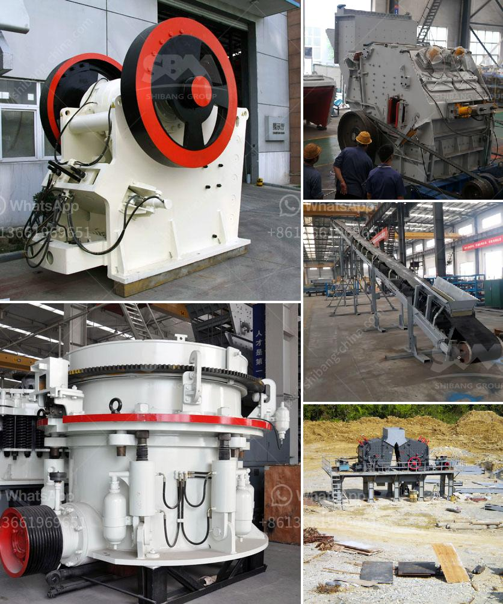

<h3>marble processing machine</h3>
Marble is a stunning and versatile natural stone that has been used for centuries in various applications, from sculptures and monuments to flooring and countertops. With its unique patterns and colors, marble adds a touch of elegance and sophistication to any space. However, the process of turning raw marble into a finished product requires advanced machinery and expertise. In this article, we will explore the world of marble processing machines and their role in transforming this beautiful stone.

Marble processing machines are specifically designed and engineered to cut, shape, and polish marble blocks or slabs into various forms and sizes. These machines play a crucial role in the production of marble products, ensuring precision, efficiency, and consistency in the manufacturing process.

One of the key machines used in marble processing is the diamond wire saw. This machine uses a thin wire embedded with diamond beads to cut through the marble block with precision and speed. The diamond beads, coated with industrial-grade diamond particles, provide a cutting ability that is unmatched by any other material. This allows for clean and smooth cuts, reducing material wastage and increasing productivity.

Another important machine in marble processing is the bridge saw. This machine is used to cut the marble slabs into precise dimensions for various applications, including flooring and countertops. The bridge saw consists of a large, sturdy platform where the marble slab is placed, and a diamond-bladed cutting tool that moves across the slab to make precise cuts. This machine ensures accuracy and consistency in cutting different pieces from a single slab, minimizing errors and simplifying production.

Once the marble is cut into the desired shape, it goes through a process called polishing. Polishing machines use abrasive pads or brushes in various grits to smoothen the surface of the marble and enhance its natural shine. These machines can be either automatic or manual, depending on the desired finish and level of customization required. The polishing process gives the marble a glossy and reflective appearance, making it truly showcase its unique patterns and colors.

In recent years, advancements in technology have led to the development of high-tech marble processing machines. These machines utilize computer numerical control (CNC) technology, allowing for superior precision and repeatability in the manufacturing process. CNC machines can perform various tasks, such as cutting, shaping, and polishing, with minimal human intervention, resulting in faster production and reduced labor costs.

Furthermore, some marble processing machines are now equipped with additional features to enhance efficiency and productivity. For example, some machines have automatic slab loading and unloading systems, eliminating the need for manual handling of heavy marble slabs. Others have laser-guided technology to assist in accurate cutting and shaping, further reducing errors and waste.

In conclusion, marble processing machines have revolutionized the production of marble products, making it faster, more precise, and cost-effective. These advanced machines, such as diamond wire saws and bridge saws, enable the transformation of raw marble into stunning and functional works of art. With further advancements in technology, the marble processing industry will continue to evolve, bringing even more efficiency and innovation to the manufacturing process.
<h3>Contact us</h3><ul><li><strong>Whatsapp:&nbsp;<a href="https://wa.me/8613661969651">+8613661969651</a></strong></li><li><a href="https://swt.shibang-china.com/?git&amp;zhl&amp;marble processing machine"><strong>Online Service(chat now)</strong></a></li></ul><h3>Related</h3><ul><li><a href='ultra fine mill price.md'>ultra fine mill price</a></li><li><a href='clay grinder machine kerala.md'>clay grinder machine kerala</a></li><li><a href='cheapest crusher machines for sale in kenya.md'>cheapest crusher machines for sale in kenya</a></li><li><a href='iron ore mobile crusher available in india.md'>iron ore mobile crusher available in india</a></li><li><a href='ballast making machine for sale.md'>ballast making machine for sale</a></li></ul>