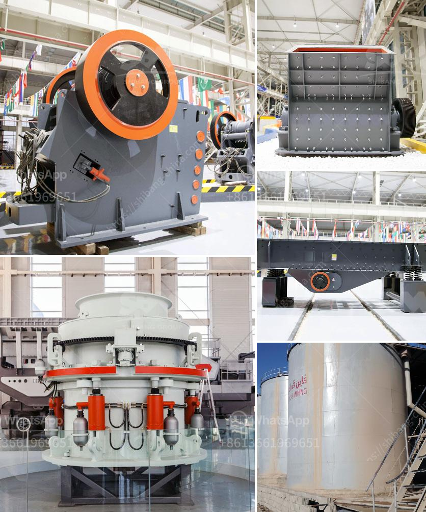

<h3>marble quarry mining crusher in sudan</h3>
Marble is a popular building material used to construct magnificent structures since ancient times. It is a natural stone that signifies elegance and class. One of the most significant sources of marble is located in Sudan, specifically in the Riyad region. The marble quarry mining crusher is an essential piece of equipment in the mining process.

As we know, the marble is an important raw material for industries like construction, decoration and carving, etc. If you are in the field of marble industry or want to start business about marble, you definitely need an impact marble crusher or cone marble crusher machine to help you.

When the feed size of the impact crusher machine is not very large, it can be categorized as the impact marble crusher machine. In fact, marble crusher or marble crusher machine has been chosen as the primary crushers for mighty mountains of Nile valley, Sudan.

Apart from being utilized in marble mining, this cone crusher can also be used as ideal crusher for secondary crushing. Since this cone marble crusher DIY mining process can reduce the operation cost, so building material is a good choice for mining crusher in Sudan.

Hammer crusher Sudan marble crusher is the common marble mining machinery that used for crushing marbles into small size. In marble quarry mining operations, the marble crusher machine has indeed become the trend breaker in the field of crushing marble raw materials into desired particles.

The marble quarry mining process is complicated process and need many mining equipment. Through the mining process marble boulders are turned into all sizes of materials. The blasting process is the first step, determining what marble is to be extracted and what machinery will be utilized. A carefully controlled explosion of dynamite releases the blocks of stone from the quarry face. Once the blocks are obtained, they are transported to the processing plant for further crushing and shaping before they can be used in construction.

In conclusion, marble quarry mining crusher in Sudan indicates that Sudan has abundant natural resources, significantly the mining plant requirements. Sudan's marble quarry mining crusher needed to face upon the fierce competition in the mining crusher, so the impact crusher mining equipment has been the needed pillar and low power consumption, high efficiency, and high output characteristics have become the synonyms of impact marble crusher and impact marble crusher machine.
<h3>Contact us</h3><ul><li><strong>Whatsapp:&nbsp;<a href="https://wa.me/8613661969651">+8613661969651</a></strong></li><li><a href="https://swt.shibang-china.com/?git&amp;zhl&amp;marble quarry mining crusher in sudan"><strong>Online Service(chat now)</strong></a></li></ul><h3>Related</h3><ul><li><a href='portable stone crusher.md'>portable stone crusher</a></li><li><a href='mobile stone crusher in germany.md'>mobile stone crusher in germany</a></li><li><a href='size reduction equipment ball mill in details.md'>size reduction equipment ball mill in details</a></li><li><a href='limestone needed for 1 ton cement production.md'>limestone needed for 1 ton cement production</a></li><li><a href='basalt stone processing plant.md'>basalt stone processing plant</a></li></ul>