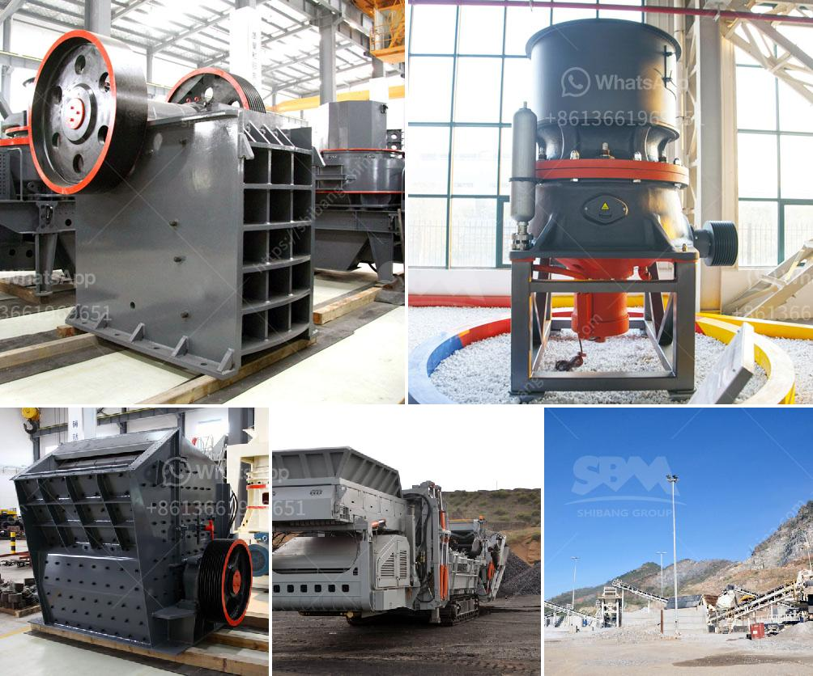

<h3>marble quarry mining in sudan</h3>
Marble is a popular choice for designing elegant and visually striking interiors, exteriors, and sculptures. It's a natural stone formed by the geological process of metamorphism, resulting in a crystalline structure that makes it strong, durable, and aesthetically pleasing. While marble is found in various countries across the globe, Sudan has rich deposits of this valuable natural resource.

Sudan's marble quarries offer an abundant supply of high-quality marble, attracting attention from both local and international markets. The marble mining industry in Sudan has flourished since the country's independence in 1956, and this thriving sector contributes significantly to Sudan's economy.

Marble quarry mining in Sudan involves drilling and blasting in the open pit, extracting the marble blocks by using cutting machines, and finally transporting them to various markets for distribution. The mining process not only requires skilled labor but also heavy machinery to extract the marble blocks efficiently.

Sudan's marble is renowned for its exceptional quality, with unique patterns and colors that vary from pure white to vibrant shades of red, green, and black. These distinct characteristics make Sudanese marble highly desirable for a wide range of applications, including flooring, cladding, countertops, and decorative sculptures.

Furthermore, Sudan's marble mining industry has created numerous employment opportunities, directly benefiting the local population. It has also facilitated the growth of supporting industries, such as transportation and logistics, further contributing to Sudan's overall economic development.

However, while the marble mining industry in Sudan has many advantages, it's essential to ensure sustainable practices are followed to minimize environmental impact. Implementing responsible mining techniques, including land restoration and biodiversity conservation, should be a priority to preserve Sudan's natural resources for future generations.

In conclusion, Sudan's marble quarry mining industry is a thriving sector that significantly contributes to the country's economy. With abundant deposits of high-quality marble, Sudan has positioned itself as a prominent player in the global marble market. By emphasizing responsible mining practices, Sudan can continue to benefit from its marble resources while preserving the environment.
<h3>Contact us</h3><ul><li><strong>Whatsapp:&nbsp;<a href="https://wa.me/8613661969651">+8613661969651</a></strong></li><li><a href="https://swt.shibang-china.com/?git&amp;zhl&amp;marble quarry mining in sudan"><strong>Online Service(chat now)</strong></a></li></ul><h3>Related</h3><ul><li><a href='high energy ball milling process.md'>high energy ball milling process</a></li><li><a href='conveyor belt price per foot.md'>conveyor belt price per foot</a></li><li><a href='price of stone crusher machine in pakistan.md'>price of stone crusher machine in pakistan</a></li><li><a href='industrial rotary dryers for sale india.md'>industrial rotary dryers for sale india</a></li><li><a href='small scale coal processing plant.md'>small scale coal processing plant</a></li></ul>