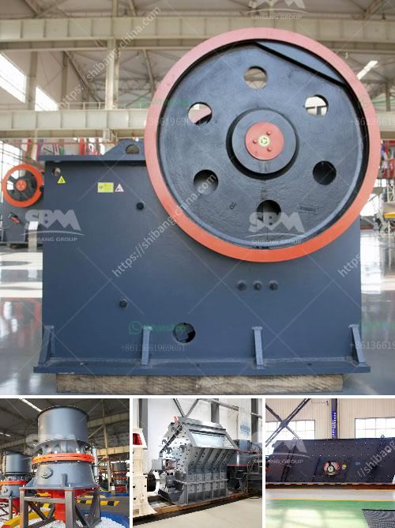

<h3>marcasite ball mill</h3>
The marcasite ball mill is a cutting-edge grinding machine that offers highly efficient and robust performance. It is widely used in various industries such as cement, metallurgy, electric power, chemical, and non-metallic mineral processing. This article provides an overview of the marcasite ball mill, highlighting its features, working principle, and advantages.

The marcasite ball mill is designed with a cylindrical shell that rotates around its axis, driven by a motor. The shell is filled with grinding media including steel balls or ceramic beads, which collide with the material to be ground, thereby reducing its particle size. The result is a finely ground powder with improved chemical and physical properties.

One of the standout features of the marcasite ball mill is its high grinding efficiency. The optimization of the grinding media size, shape, and distribution within the mill ensures effective comminution of particles. This not only enhances the product quality but also reduces energy consumption, making it an environmentally friendly solution.

Furthermore, the marcasite ball mill operates with a low noise level, ensuring a quiet working environment. The noise reduction is achieved through the use of noise-absorbing materials and advanced noise control technology. As a result, operators can work in a peaceful atmosphere, minimizing any disturbance caused by the grinding process.

The marcasite ball mill also boasts a user-friendly design, making it easy to install, operate, and maintain. The machine is equipped with a comprehensive control system that monitors the mill's performance in real-time. This enables the operator to optimize the grinding process, ensuring maximum productivity and efficiency.

Moreover, the marcasite ball mill is highly durable and resistant to wear. The grinding media used in the mill are made of high-quality materials that can withstand the harsh conditions of grinding. This extends the machine's lifespan and reduces the need for frequent replacements, resulting in significant cost savings for the user.

Another advantage of the marcasite ball mill is its versatility. It can be used for both wet and dry grinding processes, accommodating a wide range of materials. This flexibility allows users to adapt the machine to their specific requirements, making it suitable for various applications across different industries.

In conclusion, the marcasite ball mill is a reliable and efficient grinding solution that offers numerous advantages. Its high grinding efficiency, low noise level, and user-friendly design make it a preferred choice for many industries. The durability, versatility, and easy maintenance of the machine further enhance its appeal. Overall, the marcasite ball mill is a valuable investment that can significantly improve the grinding process and enhance product quality.
<h3>Contact us</h3><ul><li><strong>Whatsapp:&nbsp;<a href="https://wa.me/8613661969651">+8613661969651</a></strong></li><li><a href="https://swt.shibang-china.com/?git&amp;zhl&amp;marcasite ball mill"><strong>Online Service(chat now)</strong></a></li></ul><h3>Related</h3><ul><li><a href='vertical mill rock.md'>vertical mill rock</a></li><li><a href='coal screening machine in india.md'>coal screening machine in india</a></li><li><a href='distributors of conveyor belts in malaysia.md'>distributors of conveyor belts in malaysia</a></li><li><a href='operation and maintenance manuals of cone crusher.md'>operation and maintenance manuals of cone crusher</a></li><li><a href='cost of limestone pulverizer.md'>cost of limestone pulverizer</a></li></ul>