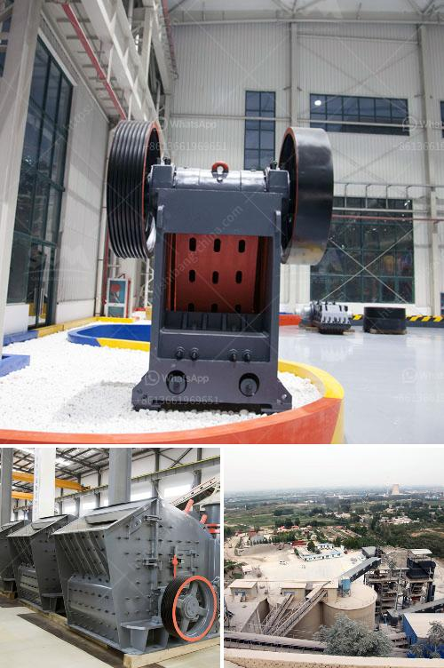

<h3>materials for assembling a stone crusher</h3>
When it comes to building a stone crusher, there are several materials you should consider. Some of these include the frame, gearbox, eccentric shaft, flywheel, moving jaw, and fixed jaw, among others. As a professional crushing and grinding equipment manufacturer, DSMAC, an expert in crusher technologies, has analysed typical raw materials and determined the optimal wear parts for different crusher types.

Based on the nature of stones and the production requirements, users can choose various crusher materials. For the frame of a stone crusher, including its components like side plates, eye bolts, and bracket plates, there are sufficient strength and rigidity. The high manganese steel lining plate inside the crusher ensures optimum durability and reduces maintenance costs.

The eccentric shaft and flywheel in a jaw crusher have a great impact on the production efficiency and the crushers' energy consumption. So, it's wise to choose the right materials for these parts. The selection of materials for the moving jaw and fixed jaw should be based on the explanation of the technical parameters. Generally, these are made from high manganese steel. This material is known for its outstanding ability to resist wear and tear, even in extreme conditions.

Apart from the main components, the crusher's wear parts also play a significant role. DSMAC, for example, supplies various types of wear parts, such as hammers, blow bars, jaws, cones, and liners for different stone crushers. With their high wear resistance and good toughness, these wear parts will keep a crusher operating efficiently and can significantly extend the service life of the machine.

In conclusion, choosing the right material for assembling a stone crusher is essential for maximizing its performance, durability, and cost-efficiency. With the wide variety of materials available, it is vital to select the ones that best suit the specific requirements and conditions. By partnering with a reputable equipment manufacturer, like DSMAC, you can ensure a high-quality stone crusher that will surpass expectations and deliver desired results.
<h3>Contact us</h3><ul><li><strong>Whatsapp:&nbsp;<a href="https://wa.me/8613661969651">+8613661969651</a></strong></li><li><a href="https://swt.shibang-china.com/?git&amp;zhl&amp;materials for assembling a stone crusher"><strong>Online Service(chat now)</strong></a></li></ul><h3>Related</h3><ul><li><a href='chrome ore beneficiation plant in china.md'>chrome ore beneficiation plant in china</a></li><li><a href='crusher in argentina stone crusher.md'>crusher in argentina stone crusher</a></li><li><a href='properties of gold mining in south africa.md'>properties of gold mining in south africa</a></li><li><a href='rock crushing machine price in india.md'>rock crushing machine price in india</a></li><li><a href='chrome washing machine plant eluvial.md'>chrome washing machine plant eluvial</a></li></ul>