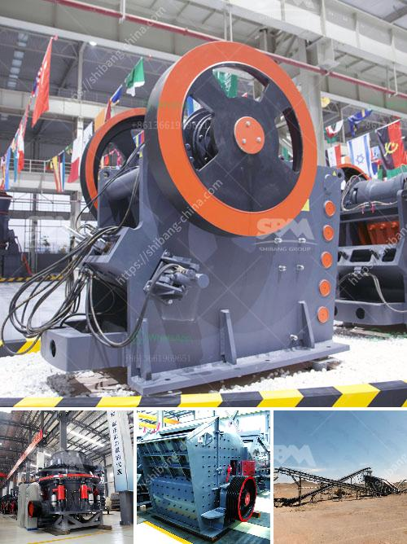

<h3>medium speed trapezium mill</h3>
The medium speed trapezium mill is a popular grinding equipment used in mining, metallurgy, construction, chemical and other industries. This mill has gained widespread recognition due to its high productivity, reliable performance, and excellent grinding result.

One of the key features of the medium speed trapezium mill is its ability to grind materials into powder with a particle size ranging from 200 mesh to 325 mesh. This wide range of fineness ensures that the mill can meet the requirements of various industries. Whether it is the production of coarse powder or the fine grinding of materials, this mill can handle it with ease.

The medium speed trapezium mill is equipped with a high-density blade system that ensures the uniform grinding of materials. This system prevents the occurrence of uneven grinding and excessive wearing of the grinding roller and grinding ring. As a result, the mill's service life is greatly extended, reducing maintenance costs for users.

Another advantage of the medium speed trapezium mill is its high drying capacity. This mill can effectively control the moisture content of materials during the grinding process, preventing the occurrence of clogging and improving the efficiency of the mill. Additionally, the mill's closed-circuit system helps to reduce dust pollution, making it an environmentally friendly choice.

The medium speed trapezium mill has been widely used in the mining industry, where it is highly regarded for its high production efficiency and low energy consumption. It is widely used in the grinding process of various ores, such as gold, copper, iron ore, and zinc ore. The mill's ability to handle different types of materials makes it a versatile machine for various industries.

In conclusion, the medium speed trapezium mill is a reliable and efficient grinding equipment that has found its place in many industries. Its ability to produce a wide range of fineness, high productivity, and low maintenance costs make it a popular choice among manufacturers. Whether it is used for coarse grinding or fine grinding, this mill consistently delivers excellent results.
<h3>Contact us</h3><ul><li><strong>Whatsapp:&nbsp;<a href="https://wa.me/8613661969651">+8613661969651</a></strong></li><li><a href="https://swt.shibang-china.com/?git&amp;zhl&amp;medium speed trapezium mill"><strong>Online Service(chat now)</strong></a></li></ul><h3>Related</h3><ul><li><a href='gypsum processing machine suppliers.md'>gypsum processing machine suppliers</a></li><li><a href='gravel screeners for sale craigslist.md'>gravel screeners for sale craigslist</a></li><li><a href='barite powder making.md'>barite powder making</a></li><li><a href='crusher plant in peshawar.md'>crusher plant in peshawar</a></li><li><a href='station mobile de lavage de diamants.md'>station mobile de lavage de diamants</a></li></ul>