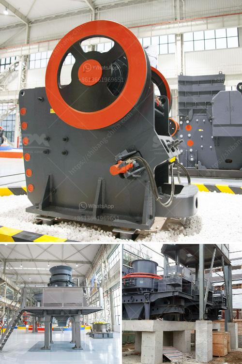

<h3>mets ball mill specification</h3>
Mets ball mills are commonly used in the grinding process of mineral ores. These mills are essential in reducing the size of the ore particles in order to facilitate further processing. The ball mill specification provided by Mets aims to cater to the specific requirements of the ore grinding process. This article will discuss these specifications in detail.

The Mets ball mill specification ensures that the mill can handle the specified capacity of ore per hour. The specific structure of the machine is designed to withstand the heavy load produced during the grinding process. The mill consists of a rotating drum, where the ore is fed for grinding, along with grinding media such as steel balls. The rotation of the drum helps in grinding the ore to the desired size.

The ball mill specification provided by Mets also includes the motor power requirement. The motor power is an important factor in determining the capacity and efficiency of the mill. Higher motor power ensures faster and more efficient grinding of the ore particles. It is important to select an appropriate motor power based on the specific requirements of the grinding process.

Another important specification of the Mets ball mill is the shell diameter and length. The size of the mill shell determines the volume of ore that can be accommodated for grinding. A larger shell diameter and length allow for a higher capacity mill. However, it is important to consider the space available in the plant or mining site before selecting the size of the mill shell.

The ball mill specification also includes the type and size of grinding media required for the grinding process. The grinding media can be made of various materials such as steel, ceramic, or natural stone. The size and type of grinding media determine the final particle size of the ground ore. It is important to select the appropriate grinding media based on the hardness and abrasiveness of the ore.

Mets ball mills are designed with safety in mind. The mill specification includes various safety features to prevent accidents during operation. These features may include emergency stop buttons, safety guards, and interlocking systems to detect abnormal conditions and shut down the mill if needed. It is important to follow the safety guidelines provided by Mets to ensure the safe and efficient operation of the ball mill.

In conclusion, Mets ball mills are designed to meet the specific requirements of the ore grinding process. The specifications provided by Mets ensure that the mills are able to handle the required capacity of ore per hour. It is important to consider factors such as motor power, shell diameter and length, grinding media type and size, and safety features when selecting a ball mill for a specific application. Mets provides a comprehensive range of ball mill specifications to cater to different mining and processing needs.
<h3>Contact us</h3><ul><li><strong>Whatsapp:&nbsp;<a href="https://wa.me/8613661969651">+8613661969651</a></strong></li><li><a href="https://swt.shibang-china.com/?git&amp;zhl&amp;mets ball mill specification"><strong>Online Service(chat now)</strong></a></li></ul><h3>Related</h3><ul><li><a href='jaw crusher machine cost.md'>jaw crusher machine cost</a></li><li><a href='price of iron ore crusher machine.md'>price of iron ore crusher machine</a></li><li><a href='small used stone crusher machine in india.md'>small used stone crusher machine in india</a></li><li><a href='rock crushers under 50 tonne per hour.md'>rock crushers under 50 tonne per hour</a></li><li><a href='roller mill diagram.md'>roller mill diagram</a></li></ul>