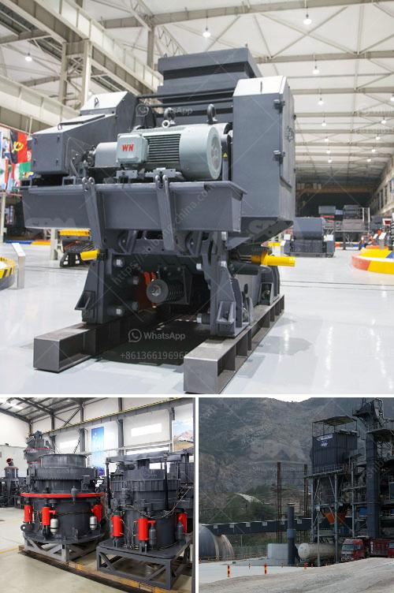

<h3>mica minerals powder grinding unit in kenya</h3>
Mica minerals are a group of silicate minerals that are widely distributed in nature. Mica has excellent thermal insulation, electrical conductivity, and high dielectric strength properties, making it one of the most widely used materials in various industries such as electronics, cosmetics, and construction. To meet the growing demand for mica minerals, a grinding unit is necessary to process mica into fine powder.

In Kenya, there is great potential for the Mica minerals powder grinding unit. Kenya has abundant mineral resources, such as soda ash, salt, fluorite, limestone, barite, gold, silver, copper, aluminum, zinc, and niobium. These resources can be used to develop the mining industry and contribute to economic growth.

The mica minerals powder grinding unit can be established in different forms. Such as grinding mill, Raymond mill, ball mill, and vertical roller mill. These grinding mills are suitable for grinding mica minerals to various finenesses according to different requirements. The final products can be used in different applications, such as cosmetics, paint, rubber, plastic, and construction materials.

Establishing a mica minerals powder grinding unit in Kenya will provide numerous benefits. Firstly, it will create employment opportunities for local communities, reducing unemployment and improving the standard of living. Secondly, it will promote the development of the mining industry, contributing to the country's economic growth. Lastly, it will reduce the dependence on imported mica minerals and help to increase self-sufficiency.

To establish a mica minerals powder grinding unit in Kenya, several factors need to be considered. These include acquiring suitable mining sites, ensuring a reliable source of raw materials, investing in modern equipment and machinery, and complying with environmental regulations. It is also important to conduct market research to understand the demand for mica minerals and identify potential customers.

In conclusion, the establishment of a mica minerals powder grinding unit in Kenya has significant potential. With the country's abundant mineral resources and growing demand for mica minerals, this investment would not only contribute to economic growth but also provide employment opportunities and promote the development of the mining industry.
<h3>Contact us</h3><ul><li><strong>Whatsapp:&nbsp;<a href="https://wa.me/8613661969651">+8613661969651</a></strong></li><li><a href="https://swt.shibang-china.com/?git&amp;zhl&amp;mica minerals powder grinding unit in kenya"><strong>Online Service(chat now)</strong></a></li></ul><h3>Related</h3><ul><li><a href='quartz production process.md'>quartz production process</a></li><li><a href='100 tph cobble crushing plant.md'>100 tph cobble crushing plant</a></li><li><a href='mining of kaolin clay in nigeria.md'>mining of kaolin clay in nigeria</a></li><li><a href='crushing plant limestone.md'>crushing plant limestone</a></li><li><a href='iron sand processing plant for sale in pakistan.md'>iron sand processing plant for sale in pakistan</a></li></ul>