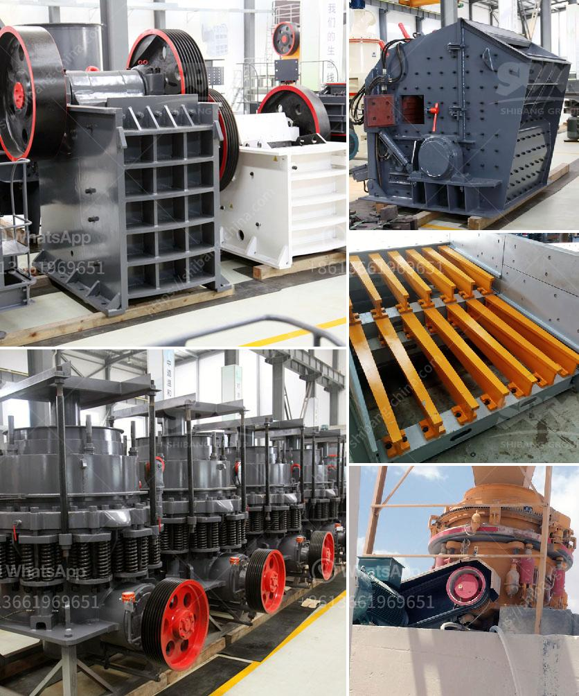

<h3>mica powder mill equipment supplier</h3>
Mica is a mineral widely used in various industries such as construction, cosmetics, and paint. As the demand for mica continues to increase, the need for efficient processing equipment becomes essential. One of the leading suppliers of mica powder mill equipment is Shanghai Clirik Machinery Co., Ltd.

Shanghai Clirik Machinery has been providing high-quality mica powder mill equipment for many years. Their advanced technology and excellent craftsmanship have made them one of the most trusted and reliable suppliers in the industry. With a strong focus on research and development, they continuously strive to improve their milling machines, ensuring optimal performance and high productivity.

The mica powder mill equipment produced by Shanghai Clirik Machinery includes a wide range of equipment, including Raymond mill, ultrafine mill, vertical roller mill, superfine vertical grinding mill, etc. These equipment can effectively improve the grinding efficiency and productivity, delivering outstanding finished fineness and uniformity.

What sets Shanghai Clirik Machinery apart from other suppliers is their commitment to providing excellent customer service. They have a team of experienced engineers and technicians who are always ready to assist their customers, provide technical support, and offer professional advice. From the initial consultation to the after-sales service, they strive to meet the specific needs of each customer.

Moreover, Shanghai Clirik Machinery also ensures that their mica powder mill equipment meets the highest quality standards. They have obtained ISO9001 certification, which guarantees the reliability and durability of their products. Additionally, their equipment is equipped with advanced dust removal systems, reducing environmental pollution and creating a safe working environment.

In conclusion, if you are looking for a reliable and efficient mica powder mill equipment supplier, Shanghai Clirik Machinery is the ideal choice. With their advanced technology, superior craftsmanship, and excellent customer service, they have become a trusted name in the industry. Contact them today for all your mica powder milling needs.
<h3>Contact us</h3><ul><li><strong>Whatsapp:&nbsp;<a href="https://wa.me/8613661969651">+8613661969651</a></strong></li><li><a href="https://swt.shibang-china.com/?git&amp;zhl&amp;mica powder mill equipment supplier"><strong>Online Service(chat now)</strong></a></li></ul><h3>Related</h3><ul><li><a href='concrete crushers for rent nigeria.md'>concrete crushers for rent nigeria</a></li><li><a href='specification for stone crushing for roads.md'>specification for stone crushing for roads</a></li><li><a href='limestone processing equipment in south africa.md'>limestone processing equipment in south africa</a></li><li><a href='hammer mill clay.md'>hammer mill clay</a></li><li><a href='propel stone crusher.md'>propel stone crusher</a></li></ul>