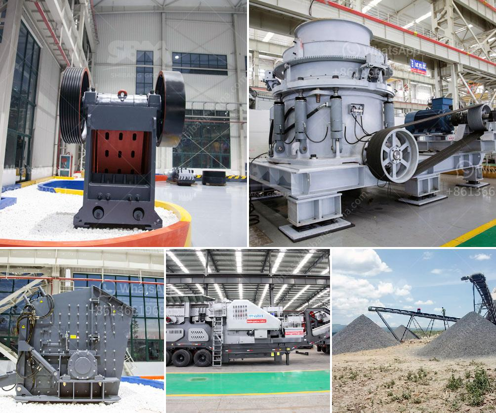

<h3>mica processing equipment</h3>
Mica is a naturally occurring mineral known for its unique physical and chemical properties, making it a versatile material with various industrial applications. It is commonly used in the production of cosmetics, paints, electrical insulators, and construction materials. However, before mica can be used in these applications, it needs to go through a meticulous processing process. This article will explore the essential equipment used in mica processing.

One of the primary steps in mica processing is the extraction of the mineral from the earth. This is achieved through mining, where advanced equipment like crushers and excavators are used to extract the mica-bearing rock from the ground. After the extraction process, the mica ore is transported to a processing plant for further refinement.

Once the mica ore reaches the processing plant, it undergoes various processes to remove impurities and ensure its purity and quality. The first step in this process is crushing and grinding, where the mica ore is reduced to the desired size using jaw crushers and ball mills. Crushing is essential to liberate the mica flakes from the surrounding rock and make it easier to separate during subsequent processing stages.

After crushing, the mica ore undergoes a process called froth flotation. In this stage, the crushed mica ore is mixed with water and a collector chemical that selectively attaches to and attracts the mica particles. Air bubbles are then introduced into the mixture, causing the mica particles to rise to the surface while the impurities sink. This process helps separate the mica from other unwanted minerals, ensuring a higher concentration of mica in the final product.

Once the flotation process is complete, the mica concentrate is further refined using a series of physical and chemical methods. These methods include drying, electromagnetic separation, and gravity separation. Drying removes any remaining moisture from the mica concentrate, while electromagnetic separation helps remove magnetic impurities. Gravity separation, on the other hand, utilizes the different densities of minerals to separate mica from other unwanted minerals.

Finally, the purified mica concentrate is further processed to produce the desired mica product for various industries. Mica can be processed into different forms such as flakes, powder, or sheets, depending on its intended application. This process involves using specialized equipment such as rotary dryers, pulverizers, and micronizers. Rotary dryers remove any remaining moisture from the mica product, while pulverizers and micronizers grind the mica into the desired particle size.

In conclusion, mica processing requires a range of equipment to extract, refine, and transform the raw mineral into a usable product. From mining to the final production stage, various machines like crushers, ball mills, and flotation cells are used to ensure the quality and purity of the mica. Additionally, specialized equipment such as rotary dryers, pulverizers, and micronizers further refine the mica concentrate into different forms to meet the diverse needs of industries. This equipment significantly contributes to efficient and effective mica processing, allowing the mineral to be utilized in an extensive range of applications.
<h3>Contact us</h3><ul><li><strong>Whatsapp:&nbsp;<a href="https://wa.me/8613661969651">+8613661969651</a></strong></li><li><a href="https://swt.shibang-china.com/?git&amp;zhl&amp;mica processing equipment"><strong>Online Service(chat now)</strong></a></li></ul><h3>Related</h3><ul><li><a href='crush basalt machine.md'>crush basalt machine</a></li><li><a href='cement mill plant design drawings.md'>cement mill plant design drawings</a></li><li><a href='mining crusher machines in selling in kenya.md'>mining crusher machines in selling in kenya</a></li><li><a href='sewa stone crusher plant.md'>sewa stone crusher plant</a></li><li><a href='components of a ball mill.md'>components of a ball mill</a></li></ul>