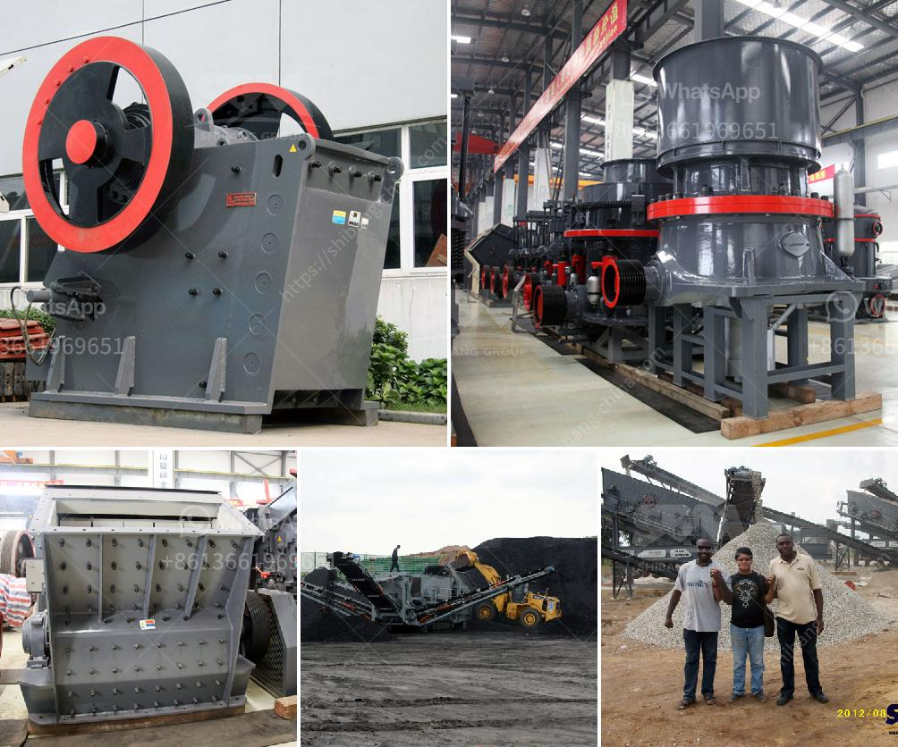

<h3>mica processing technology and flow chart</h3>
Mica is a mineral that is widely used in various industries due to its unique properties. It is known for its excellent electrical, thermal, and mechanical properties, making it an essential component in products such as electronics, cosmetics, insulation materials, and paints.

Mica processing technology has evolved over the years to ensure its effective extraction and purification. The primary processing steps involve crushing and grinding the raw material into a fine powder. This process helps to remove impurities and separate the mica flakes from the rock.

Once the mica has been crushed and ground, it undergoes a series of separation processes to obtain the desired grade of mica. Gravity separation and froth flotation are commonly used techniques for mica beneficiation. Gravity separation relies on the differences in specific gravity between mica and gangue minerals, while froth flotation utilizes the property of selectively attaching air bubbles to the mica particles.

After the mica concentrate is obtained, it undergoes further processing to remove any remaining impurities. This may involve magnetic separation, electrostatic separation, or a combination of both. These processes help to reduce the iron and titanium content in the mica, ensuring its purity and enhancing its properties.

Lastly, the purified mica is dried and classified according to its particle size. The classification process ensures that the mica is of the desired size and can be used in specific applications. The final product is then ready to be used in various industries, depending on its grade and quality.

In conclusion, mica processing technology has advanced significantly, allowing for efficient extraction and purification of this versatile mineral. The flow chart for mica processing involves crushing, grinding, separation, purification, drying, and classification. With the continuous development of technology, the mica processing industry can further improve its efficiency and meet the growing demands of various industries.
<h3>Contact us</h3><ul><li><strong>Whatsapp:&nbsp;<a href="https://wa.me/8613661969651">+8613661969651</a></strong></li><li><a href="https://swt.shibang-china.com/?git&amp;zhl&amp;mica processing technology and flow chart"><strong>Online Service(chat now)</strong></a></li></ul><h3>Related</h3><ul><li><a href='toner powder making machine.md'>toner powder making machine</a></li><li><a href='limestone needed for 1 ton cement production.md'>limestone needed for 1 ton cement production</a></li><li><a href='specification for stone crushing for roads.md'>specification for stone crushing for roads</a></li><li><a href='gypsum manufacturing plant from turkey.md'>gypsum manufacturing plant from turkey</a></li><li><a href='sand mining equipment malaysia.md'>sand mining equipment malaysia</a></li></ul>