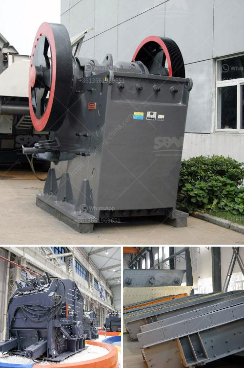

<h3>micro fine grinding machine</h3>
Microfine grinding machines are becoming more and more important in today's world. With the continuous advancements in technology, industries are constantly searching for new methods to perfect their products. The microfine grinding machine is one such innovation that has paved the way for advancements in various industries, including pharmaceuticals, cosmetics, and food processing.

The microfine grinding machine operates on the principle of impact grinding. Its rotating disc mechanism distributes the material evenly, ensuring a consistent grind. The machine is equipped with specially designed hammers that deliver an exceptional grinding performance. This results in a finer and more uniform finished product.

One of the major advantages of microfine grinding machines is their ability to produce powders with a particle size in the range of 5 to 10 microns. This fine particle size is essential in many industries where precise product specifications are required. For example, in the pharmaceutical industry, the particle size of medications plays a crucial role in their effectiveness. By utilizing microfine grinding machines, pharmaceutical companies can ensure that their medications are suitable for optimal absorption and deliver the desired therapeutic effects.

Cosmetics is another industry that greatly benefits from microfine grinding machines. The production of various cosmetic products, such as powders, creams, and lotions, often requires the use of finely ground materials. Microfine grinding machines provide the perfect solution for achieving the desired particle size in cosmetic formulations. The resulting fine powders not only improve the aesthetics and texture of the final product, but also enhance its effectiveness, ensuring even application and maximum results.

Food processing is yet another industry where microfine grinding machines are gaining popularity. In food manufacturing, achieving the desired texture and consistency is crucial. With microfine grinding machines, food companies can precisely grind ingredients such as spices, herbs, and grains. This allows for the creation of flavorful and consistent products, while ensuring uniformity in taste and texture.

The microfine grinding machine also offers significant advantages in terms of product quality and efficiency. Due to its precise grinding mechanism, the machine ensures minimal loss of material during the grinding process. This directly translates into cost savings for manufacturers, as they can maximize the utilization of their raw materials. Additionally, the machine's high-speed rotation reduces the overall processing time, increasing productivity and throughput.

In conclusion, microfine grinding machines are revolutionizing various industries by providing precise and efficient grinding solutions. With the ability to produce powders with a particle size in the range of 5 to 10 microns, these machines have become indispensable in fields such as pharmaceuticals, cosmetics, and food processing. Their ability to deliver consistent and high-quality results makes them a preferred choice for manufacturers looking to improve their products and processes. As technology continues to advance, microfine grinding machines will continue to play a vital role in enhancing product quality and driving growth in various industries.
<h3>Contact us</h3><ul><li><strong>Whatsapp:&nbsp;<a href="https://wa.me/8613661969651">+8613661969651</a></strong></li><li><a href="https://swt.shibang-china.com/?git&amp;zhl&amp;micro fine grinding machine"><strong>Online Service(chat now)</strong></a></li></ul><h3>Related</h3><ul><li><a href='jaw crusher for graphite.md'>jaw crusher for graphite</a></li><li><a href='dolomite mining and processing.md'>dolomite mining and processing</a></li><li><a href='handmade stone crusher.md'>handmade stone crusher</a></li><li><a href='crusher plant in tarlac.md'>crusher plant in tarlac</a></li><li><a href='coal screening process.md'>coal screening process</a></li></ul>