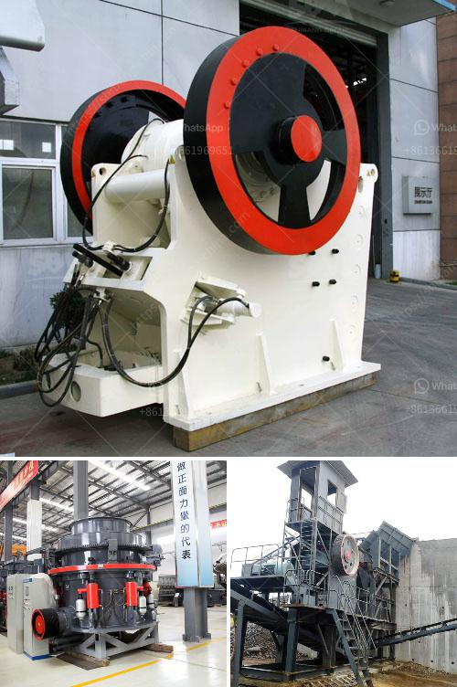

<h3>micro powder grinding mill</h3>
Micro powder grinding mill, also known as ultrafine grinding mill, is a kind of grinding equipment which takes advanced technology from both abroad and domestic, and developed based on many years' experience in ultrafine grinding industry. It is capable of processing various non-flammable and non-explosive materials with Mohs hardness below 7 and moisture content less than 6%, such as quartz, feldspar, talc, calcite, limestone, marble, barite, dolomite, granite, kaolin, bauxite, etc.

Micro powder grinding mill has the advantages of low investment cost, high efficiency, low energy consumption, simple operation, continuous production, and stable product quality. It is widely used in the fields of metallurgy, building materials, chemical industry, mining, highway construction, water conservancy, refractory materials, cement, coal powder, glass, ceramics, etc.

The main working principle of micro powder grinding mill is that the grinding roller and ring are driven by the main motor, and the grinding roller is rotated during the process. The grinding roller and ring compress the materials and crushes them. After being ground, the materials are brought into the powder classifier by the airflow of the blower, and the qualified fine powder will enter the powder collector with the airflow. Coarse particles will fall back to the grinding chamber for regrinding until they are qualified.

Micro powder grinding mill has become popular in recent years due to its higher fineness and capacity compared to traditional Raymond mill. It is the preferred choice for grinding various materials into fine powder. With the continuous development of technology, micro powder grinding mill will play an increasingly important role in the powder industry. Whether in the field of mineral processing or non-metallic industries, micro powder grinding mill will continue to be upgraded and improved to meet the market demand for finer and higher quality products.
<h3>Contact us</h3><ul><li><strong>Whatsapp:&nbsp;<a href="https://wa.me/8613661969651">+8613661969651</a></strong></li><li><a href="https://swt.shibang-china.com/?git&amp;zhl&amp;micro powder grinding mill"><strong>Online Service(chat now)</strong></a></li></ul><h3>Related</h3><ul><li><a href='harga jaw crusher x.md'>harga jaw crusher x</a></li><li><a href='gold mining equipment companies in china.md'>gold mining equipment companies in china</a></li><li><a href='how to dismantle a cone crusher.md'>how to dismantle a cone crusher</a></li><li><a href='jaw industry limestone process.md'>jaw industry limestone process</a></li><li><a href='copper ore concentration processing.md'>copper ore concentration processing</a></li></ul>