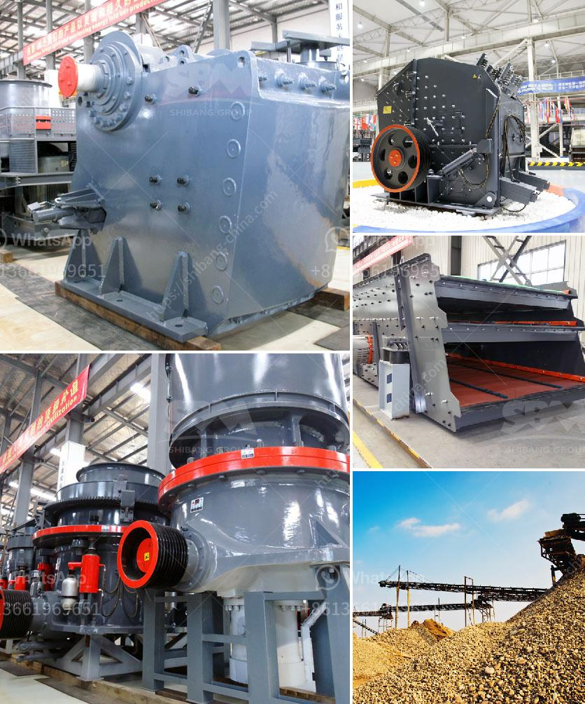

<h3>mill balls for mill in bolivia</h3>
Mill balls, also known as grinding media, are key components in efficient grinding processes in mills. These small metallic spheres are essential for breaking down and refining various materials, including minerals, ores, and chemicals. In Bolivia, where mining is a significant industry, high-quality mill balls play a vital role in ensuring efficient and productive mill operations.

The primary purpose of mill balls is to crush and grind the material within the mill, allowing for the extraction of valuable minerals or the creation of fine powders. The abrasive nature of these balls allows for the efficient breakdown of materials through impact and attrition. As the mill rotates, the mill balls cascade and tumble, grinding the material into smaller particles.

One critical factor affecting the performance of mill balls is their hardness. Hardness is a measure of a material's resistance to abrasion, and it directly influences the grinding efficiency and wear rate of mill balls. Therefore, selecting mill balls with the appropriate hardness for the specific grinding application is crucial.

In Bolivia, where mining activities are prevalent, mill balls are subjected to intense wear, challenging their durability. Consequently, steel alloys with high hardness and excellent wear resistance, such as chrome or forged steel balls, are extensively used in Bolivian mills. These mill balls can withstand the harsh conditions, ensuring longer service life, reduced downtime, and improved milling efficiency.

Moreover, the size of the mill balls also affects the grinding process. Different milling applications require specific ball sizes to achieve optimal results. Larger mill balls are typically used for coarse grinding, while smaller balls excel in fine grinding operations. By selecting the appropriate mill ball size, Bolivian mill operators can achieve the desired grind size and maximize the efficiency of their mills.

Given the importance of mill balls in Bolivian mills, it is essential to procure them from reputable suppliers who offer high-quality and properly tested products. Reliable suppliers ensure that the mill balls conform to international standards, have consistent hardness, and undergo rigorous quality control measures.

In conclusion, mill balls are indispensable components for efficient grinding in Bolivian mills. Their hardness, wear resistance, and appropriate sizing directly influence the grinding process, resulting in improved productivity and reduced downtime. Bolivian mill operators must prioritize the procurement of high-quality mill balls to sustain optimal mill performance and maximize the extraction and refining of valuable materials in this vital industry.
<h3>Contact us</h3><ul><li><strong>Whatsapp:&nbsp;<a href="https://wa.me/8613661969651">+8613661969651</a></strong></li><li><a href="https://swt.shibang-china.com/?git&amp;zhl&amp;mill balls for mill in bolivia"><strong>Online Service(chat now)</strong></a></li></ul><h3>Related</h3><ul><li><a href='roller mill calcium.md'>roller mill calcium</a></li><li><a href='jaw crusher manganese.md'>jaw crusher manganese</a></li><li><a href='gold ore mill for sale in canada.md'>gold ore mill for sale in canada</a></li><li><a href='iron ore beneficiation process flow chart.md'>iron ore beneficiation process flow chart</a></li><li><a href='bauxite beneficiation process.md'>bauxite beneficiation process</a></li></ul>