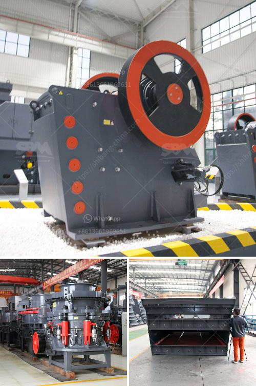

<h3>mill grinder for sale</h3>
If you are someone who enjoys a freshly ground cup of coffee every morning or loves experimenting with different types of spices, then investing in a mill grinder is a must! This versatile kitchen tool allows you to grind your own coffee beans, spices, grains, and more, providing you with an enhanced flavor experience. Whether you are a coffee aficionado or a cooking enthusiast, finding a mill grinder for sale can greatly improve your daily routine.

When it comes to purchasing a mill grinder, there are several factors to consider. Firstly, you need to decide on the type of mill grinder that suits your needs. There are manual grinders, electric grinders, and even burr grinders available in the market. Manual grinders are portable and offer a hands-on approach, allowing you to control the size of the grind. On the other hand, electric grinders tend to be more efficient and time-saving, especially if you require a large quantity of ground beans or spices. Burr grinders are known for their consistency and ability to maintain the aroma and flavor of the beans or spices.

Once you have determined the type of mill grinder you prefer, it is important to consider the grinder's specifications. Look for a grinder with multiple grind settings, allowing you to experiment with different coarseness levels. This feature is particularly significant if you enjoy various brewing methods, such as espresso, French press, or pour-over coffee. Additionally, ensure that the grinder is easy to clean and maintain. This will save you time and effort, especially if you plan to use it frequently.

Furthermore, it is crucial to research and compare prices before making a purchase. Although quality mill grinders may be available at a higher price point, they often provide better performance and longevity. Keep in mind that a sturdy and durable grinder will serve you for years, making it a worthwhile investment.

When searching for a mill grinder for sale, consider checking out reputable online retailers, local kitchenware stores, or even thrift shops. Online platforms often offer a wide range of options and convenient delivery services. On the other hand, local stores may provide personalized assistance and the opportunity to test different grinders. Thrift shops can sometimes be treasure troves, where you may stumble upon a vintage mill grinder with a rich history.

Mill grinders can truly elevate your cooking or brewing experience. By grinding your own beans or spices, you have full control over the freshness and flavor. The aroma that fills your kitchen as you grind the ingredients is unmatched, creating anticipation for a delicious meal or cup of coffee.

In conclusion, finding a mill grinder for sale can revolutionize your daily routine in the kitchen or at the breakfast table. Consider your brewing or cooking preferences, the grinder's specifications, and the price range that works for you. With the right mill grinder, you can enjoy the freshest and most flavorful ingredients every time. So go ahead and embark on this flavorful journey – your taste buds will thank you!
<h3>Contact us</h3><ul><li><strong>Whatsapp:&nbsp;<a href="https://wa.me/8613661969651">+8613661969651</a></strong></li><li><a href="https://swt.shibang-china.com/?git&amp;zhl&amp;mill grinder for sale"><strong>Online Service(chat now)</strong></a></li></ul><h3>Related</h3><ul><li><a href='rock crushing equipment price.md'>rock crushing equipment price</a></li><li><a href='total cost of machinery of stone crusher.md'>total cost of machinery of stone crusher</a></li><li><a href='placer mining wash plant operating costs.md'>placer mining wash plant operating costs</a></li><li><a href='process of preparing clay crusher.md'>process of preparing clay crusher</a></li><li><a href='concrete batching plant for sale in pakistan.md'>concrete batching plant for sale in pakistan</a></li></ul>