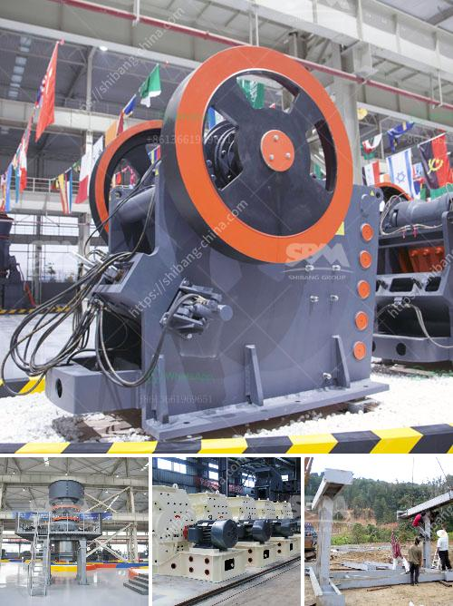

<h3>millia deasel grinding mill and prices</h3>
Grinding mills have become an integral part of various industries, catering to the need for fine and consistent particle size reduction. Whether it is for food processing, pharmaceuticals, chemicals, or minerals, a high-quality grinding mill is essential for achieving the desired product specifications. Millia Deasel Grinding Mill stands as a reliable and cost-effective solution for all your grinding requirements, offering superior performance and efficiency.

One of the key features that sets Millia Deasel Grinding Mill apart is its robust construction. Built to last, these mills are designed to withstand demanding working conditions and provide long-lasting performance. With its durable materials and precision engineering, Millia Deasel Grinding Mill ensures minimal maintenance requirements and longer service life, saving both time and money.

Another standout feature of Millia Deasel Grinding Mill is its versatility. Designed to handle a wide range of materials, from grains and seeds to pharmaceutical powders and chemicals, this grinding mill can efficiently process them all. Whether you are looking to achieve a coarse grind or a fine powder, Millia Deasel Grinding Mill delivers consistent results, ensuring uniform particle size distribution every time.

When it comes to pricing, Millia Deasel Grinding Mill offers competitive rates, making it an ideal choice for budget-conscious businesses. With its affordable price point, this grinding mill provides excellent value for money without compromising on quality. Furthermore, Millia Deasel Grinding Mill offers various models and sizes to cater to different production needs, allowing businesses to choose the right fit for their requirements and budget.

In addition to its competitive pricing, Millia Deasel Grinding Mill boasts impressive operational efficiency. Equipped with high-performance motors, these mills deliver exceptional grinding speed, reducing overall processing time. This results in increased productivity and cost savings for businesses, making Millia Deasel Grinding Mill an excellent investment.

Moreover, Millia Deasel Grinding Mill places great emphasis on user convenience. These mills are designed with user-friendly features that make them easy to operate and maintain. From quick and hassle-free assembly to simple cleaning, Millia Deasel Grinding Mill ensures a seamless grinding experience for its users. This not only saves valuable time but also enhances overall operational efficiency.

The reputation of Millia Deasel Grinding Mill as a trusted brand is further strengthened by its excellent after-sales service. The company provides comprehensive customer support, including technical assistance and prompt spare parts availability. With Millia Deasel Grinding Mill, you can be confident that your grinding mill will continue to perform optimally throughout its lifespan.

In conclusion, Millia Deasel Grinding Mill is a reliable and cost-effective solution for businesses in need of high-quality grinding equipment. With its robust construction, versatile performance, competitive pricing, and exceptional operational efficiency, this grinding mill exceeds industry standards in every aspect. Investing in Millia Deasel Grinding Mill ensures efficient grinding and consistent product quality, ultimately leading to improved profitability for your business.
<h3>Contact us</h3><ul><li><strong>Whatsapp:&nbsp;<a href="https://wa.me/8613661969651">+8613661969651</a></strong></li><li><a href="https://swt.shibang-china.com/?git&amp;zhl&amp;millia deasel grinding mill and prices"><strong>Online Service(chat now)</strong></a></li></ul><h3>Related</h3><ul><li><a href='runner crusher china price.md'>runner crusher china price</a></li><li><a href='jaw crusher machine price.md'>jaw crusher machine price</a></li><li><a href='copper crusher manufacturer.md'>copper crusher manufacturer</a></li><li><a href='spec for 200 tph crushing plant.md'>spec for 200 tph crushing plant</a></li><li><a href='belt conveyor calculation sheet.md'>belt conveyor calculation sheet</a></li></ul>