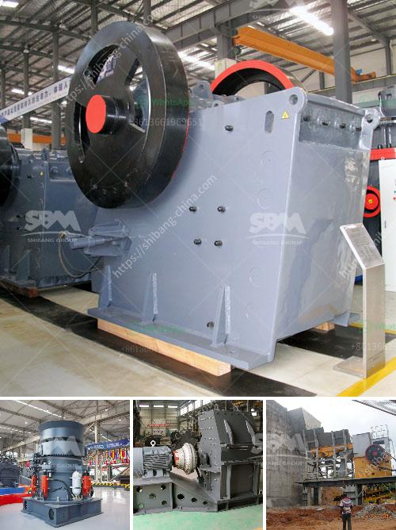

<h3>milling machine made in russia manufacturer in india</h3>
Russian manufacturing has long been renowned for its precision engineering and advanced technological capabilities. Over the years, Russian machinery manufacturers have gained a solid reputation across global markets. In recent times, the Indian industry has been witnessing a remarkable surge in the demand for Russian-made milling machines. This article explores the success story of a Russian milling machine manufacturer entering the Indian market and its impact on the Indian manufacturing landscape.

One such notable Russian manufacturer is XYZ Company, known for its superior quality milling machines designed for various industrial applications. XYZ Company has recently expanded its manufacturing operations to India, capitalizing on the nation's growing industrial sector. With a robust track record in Russia, XYZ Company brings its technological expertise to serve the Indian market with highly reliable milling machines.

Russian milling machines are known for their exceptional durability, precision, and versatility. These machines are specifically designed to meet the ever-increasing demands of the manufacturing industry. XYZ Company's milling machines feature cutting-edge technology and undergo rigorous quality checks to ensure optimal performance, accuracy, and longevity. Additionally, these machines are adaptable to a wide range of materials, catering to diverse industrial requirements.

India's manufacturing sector has been rapidly expanding due to the government's push for initiatives like "Make in India" and increased foreign direct investment. The milling machine industry in India witnessed a void where high-quality, reliable machines were required to sustain the growing industrial demands. XYZ Company identified this opportunity and decided to set up operations in India, offering Russian-made milling machines to the Indian manufacturers.

To further enhance their market presence, XYZ Company has strategically partnered with Indian enterprises, providing them with specialized milling machines customized to their specific production needs. This approach ensures that Indian manufacturers receive machines that are tailor-made to optimize their production efficiency while maintaining the highest quality standards. Such collaboration between Russian manufacturers and Indian enterprises will undoubtedly contribute to the growth and development of the Indian manufacturing sector.

In addition to serving the growing Indian manufacturing industry, XYZ Company's decision to establish manufacturing operations in India has also generated employment opportunities in the country. The local workforce benefits from the transfer of Russian expertise and technological knowledge, enabling the development of skilled jobs in India's manufacturing sector. This not only supports the Indian government's employment generation objectives but also helps in upskilling the local workforce, giving them exposure to advanced manufacturing techniques.

The collaboration between Russian and Indian manufacturers has opened new avenues for the Indian industrial landscape. The entry of Russian-made milling machines, exemplified by XYZ Company, has addressed the demand for reliable, high-performance machines in the Indian market. The partnership between the two countries brings forth the combined strengths of Russian precision engineering and India's rapidly expanding manufacturing sector. As a result, the Indian manufacturing industry can now rely on top-notch milling machines for their various production needs, ensuring continuous growth and success.
<h3>Contact us</h3><ul><li><strong>Whatsapp:&nbsp;<a href="https://wa.me/8613661969651">+8613661969651</a></strong></li><li><a href="https://swt.shibang-china.com/?git&amp;zhl&amp;milling machine made in russia manufacturer in india"><strong>Online Service(chat now)</strong></a></li></ul><h3>Related</h3><ul><li><a href='components of an impact mill.md'>components of an impact mill</a></li><li><a href='nigeria inpactor crushers price.md'>nigeria inpactor crushers price</a></li><li><a href='ball mill machine in nigeria.md'>ball mill machine in nigeria</a></li><li><a href='cost of limestone pulverizer.md'>cost of limestone pulverizer</a></li><li><a href='jaw crusher supplier in jakarta.md'>jaw crusher supplier in jakarta</a></li></ul>