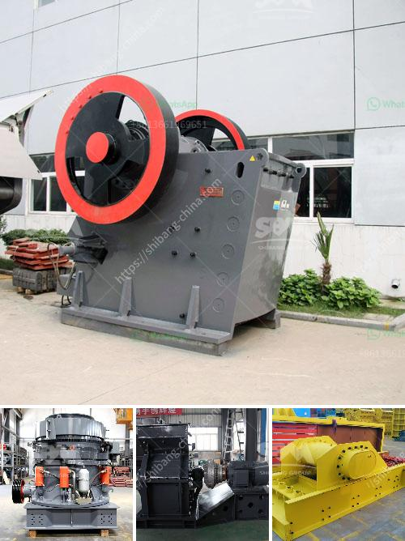

<h3>mineral beneficiation screening ppt</h3>
Mineral beneficiation screening is a process used to separate valuable minerals from their ores. It is commonly used in the mining industry, where valuable minerals are extracted from the ore by crushing and grinding the rock to a desired size. The process involves various stages, including crushing, screening, and washing, and it is essential for the efficient recovery of minerals.

The first stage of mineral beneficiation screening is crushing, where the ore is crushed into smaller pieces to facilitate further processing. This is typically done using a jaw crusher, which applies pressure to the ore, breaking it into smaller particles. The crushed ore is then transferred to a screening plant, where it is separated into different size fractions.

The next stage is screening, which involves the separation of mineral particles based on their size. The purpose of screening is to ensure that the particles are within the desired size range for further processing. Screening can be done using various types of screens, including vibrating screens and trommel screens.

Vibrating screens are commonly used in the mining industry for mineral beneficiation screening. These screens consist of a vibrating deck with different-sized openings, allowing particles of the desired size to pass through and fall onto a conveyor belt for further processing. The vibrating motion of the screen helps to separate the particles based on their size, ensuring that only the appropriate fraction is processed.

Trommel screens are another type of screen used for mineral beneficiation screening. These screens consist of a cylindrical drum with perforated walls. The ore is fed into the drum, and as it rotates, smaller particles pass through the holes, while larger particles are retained inside the drum. The retained particles are then discharged at the end of the drum for further processing.

In addition to screening, washing is another important stage in mineral beneficiation. After screening, the ore may still contain impurities or unwanted materials that need to be removed. Washing involves the use of water or other fluids to remove these impurities. The ore is typically washed using a rotating drum or a vibrating screen, allowing the water to remove the unwanted materials. The clean ore particles are then collected and sent for further processing.

Overall, mineral beneficiation screening is a crucial process in the mining industry. It allows for the efficient recovery of valuable minerals from the ore, ensuring their economic extraction. By crushing, screening, and washing the ore, the desired minerals can be separated and processed for various applications. The use of different screens, such as vibrating screens and trommel screens, helps to achieve the desired size fractionation, while washing removes impurities, ensuring a high-quality final product.
<h3>Contact us</h3><ul><li><strong>Whatsapp:&nbsp;<a href="https://wa.me/8613661969651">+8613661969651</a></strong></li><li><a href="https://swt.shibang-china.com/?git&amp;zhl&amp;mineral beneficiation screening ppt"><strong>Online Service(chat now)</strong></a></li></ul><h3>Related</h3><ul><li><a href='50tph jaw crusher with magnet.md'>50tph jaw crusher with magnet</a></li><li><a href='crushing plant in montalban.md'>crushing plant in montalban</a></li><li><a href='china stone crusher closed circuit.md'>china stone crusher closed circuit</a></li><li><a href='mineral pulverizer to 300 micron.md'>mineral pulverizer to 300 micron</a></li><li><a href='fairly used quarry crusher in nigeria price.md'>fairly used quarry crusher in nigeria price</a></li></ul>