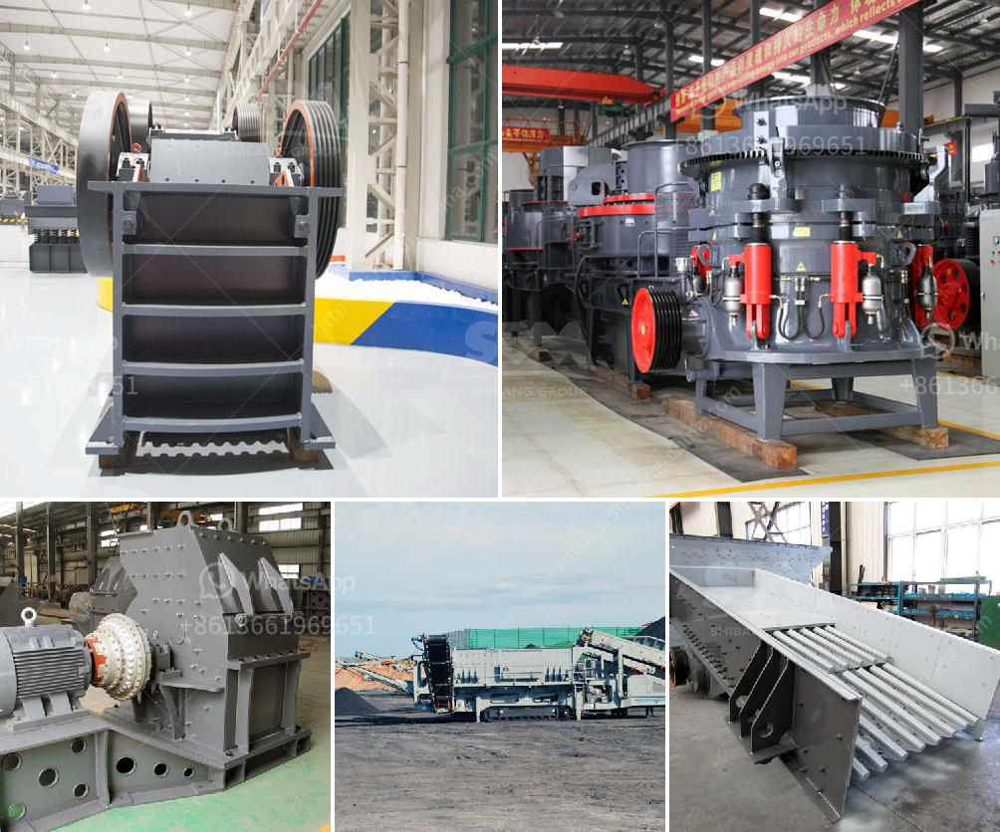

<h3>mineral pulverizer to 300 micron</h3>
When it comes to processing minerals, size reduction is an essential part of the process. The mineral pulverizer plays a crucial role in this process, crushing minerals into smaller particles with sizes as low as 300 microns. In this article, we will discuss the significance of mineral pulverizers and how they achieve such fine particle sizes.

Firstly, let us understand the concept of mineral pulverizers. These machines are designed to reduce the size of minerals and other materials by grinding or crushing them. The main objective is to break down the raw materials into smaller particles, which can then be further processed or utilized in various industries.

One of the key advantages of reducing minerals to 300 microns is the increased surface area. Smaller particle sizes provide greater contact points, allowing for improved chemical reactions and faster dissolution rates. This is particularly important in industries like mining, where minerals undergo subsequent treatment processes such as leaching or flotation.

The mineral pulverizer achieves micron-sized particles through a combination of crushing and grinding mechanisms. Initially, the mineral rocks are fed into the machine, where they are subjected to high-speed rotating hammers or blades. These hammers or blades strike the rocks, breaking them apart into smaller pieces.

The broken mineral particles then pass through a series of grinding plates or rollers, which further reduce their size. The gap between these plates or rollers can be adjusted to achieve the desired particle size. By controlling the gap, the mineral pulverizer can effectively reduce minerals to the target micron range, typically between 300 to 500 microns.

Apart from size reduction, the mineral pulverizer also helps in homogenizing the mineral particles. The grinding and crushing actions ensure that the mineral particles are evenly distributed throughout the final product. This homogeneity is essential in industries that require consistent particle sizes for downstream processing or product manufacturing.

The mineral pulverizer is a versatile machine that can be customized to suit specific mineral processing requirements. Various factors such as the type of mineral, hardness, moisture content, and desired particle size determine the pulverizer's design and configuration. For example, some mineral pulverizers are equipped with air classification systems to separate fine particles from coarse ones.

The use of mineral pulverizers in different industries is extensive. Mining companies rely on these machines to process various minerals, including copper, gold, iron ore, and coal. These minerals need to be finely ground to improve their recovery rates and yield. Similarly, industries like pharmaceuticals, chemicals, and construction utilize mineral pulverizers for diverse applications.

In conclusion, mineral pulverizers are essential in the mineral processing industry for reducing minerals to finer particles. Achieving particle sizes as low as 300 microns is crucial for enhanced surface area and improved reactivity. The machinery's ability to crush and grind minerals ensures homogeneity and facilitates subsequent processing steps. By tailoring the pulverizer's design and configuration to specific requirements, industries can effectively process minerals and optimize their overall production. The mineral pulverizer, therefore, plays a vital role in ensuring efficient mineral processing and meeting the industry's demands for fine particle sizes.
<h3>Contact us</h3><ul><li><strong>Whatsapp:&nbsp;<a href="https://wa.me/8613661969651">+8613661969651</a></strong></li><li><a href="https://swt.shibang-china.com/?git&amp;zhl&amp;mineral pulverizer to 300 micron"><strong>Online Service(chat now)</strong></a></li></ul><h3>Related</h3><ul><li><a href='conveyor belts in merida.md'>conveyor belts in merida</a></li><li><a href='mini jaw crusher for sale used.md'>mini jaw crusher for sale used</a></li><li><a href='double sided fine grinding machines price.md'>double sided fine grinding machines price</a></li><li><a href='gypsum powder making plant.md'>gypsum powder making plant</a></li><li><a href='raymond mill technical specification.md'>raymond mill technical specification</a></li></ul>