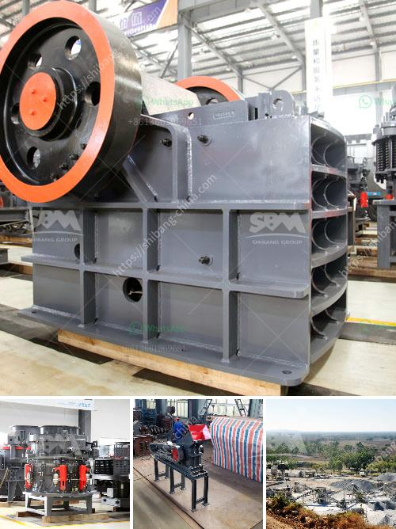

<h3>mini cement plant for sale in india</h3>
The Indian construction industry has been experiencing rapid growth in recent years, leading to an increased demand for cement. To cater to this demand, many cement manufacturers have been setting up mini cement plants in different parts of the country. These mini cement plants are smaller in size but have the capacity to produce up to 200 tons of cement per day. With technological advancements, these mini cement plants have become cost-effective and are suitable for small-scale businesses and rural areas.

One of the major advantages of mini cement plants is that they can be set up in remote locations. This reduces transportation costs, as the raw materials for cement production can be sourced locally. Additionally, it eliminates the need for large-scale infrastructure, making it more affordable and accessible for entrepreneurs with limited capital.

The mini cement plant for sale in India offers a lucrative opportunity for investors and entrepreneurs. The growing infrastructure projects and government initiatives for affordable housing are driving the demand for cement in the country. By investing in a mini cement plant, one can benefit from this rising demand and contribute to the nation's growth and development.

Apart from meeting the local demand, these mini cement plants also have the potential to export cement to neighboring countries. With its strategic location and competitive pricing, India can become a major cement exporter in the region. This opens up avenues for increased profitability and growth for mini cement plant owners.

When considering the purchase of a mini cement plant in India, it is crucial to assess the quality of the plant, its production capacity, and the technology used. Additionally, one should also consider the after-sales support provided by the manufacturer.

In conclusion, the mini cement plant for sale in India is an attractive investment opportunity for those looking to venture into the cement industry. With its low investment requirement, flexibility, and potential for high returns, it provides a pathway to success for small-scale entrepreneurs. By capitalizing on the growing demand for cement, one can contribute to the country's infrastructure development and reap the benefits of this flourishing sector.
<h3>Contact us</h3><ul><li><strong>Whatsapp:&nbsp;<a href="https://wa.me/8613661969651">+8613661969651</a></strong></li><li><a href="https://swt.shibang-china.com/?git&amp;zhl&amp;mini cement plant for sale in india"><strong>Online Service(chat now)</strong></a></li></ul><h3>Related</h3><ul><li><a href='crusher machine in europe.md'>crusher machine in europe</a></li><li><a href='quarry crusher rules.md'>quarry crusher rules</a></li><li><a href='mobile crushing unit.md'>mobile crushing unit</a></li><li><a href='crushing b series vsi crusher.md'>crushing b series vsi crusher</a></li><li><a href='ball mill mesh size.md'>ball mill mesh size</a></li></ul>