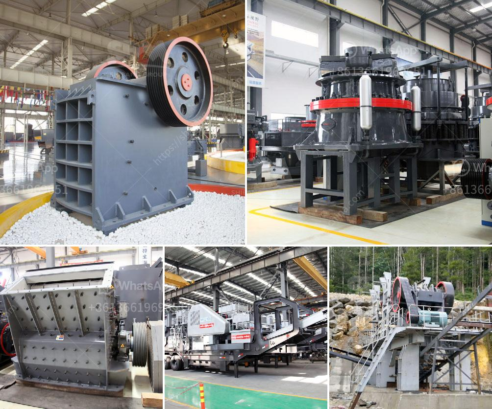

<h3>mini concrete crushers</h3>
In the construction industry, the need for on-site crushing has become increasingly prominent in recent years. With the rise of urbanization, developers are faced with the challenge of disposing large amounts of concrete waste. This waste not only takes up valuable space but also adds to the cost and environmental impact of construction projects. To combat this issue, mini concrete crushers have emerged as a convenient and efficient solution to on-site crushing needs.

Mini concrete crushers are compact machines that are used to reduce the size of larger concrete structures or demolish unnecessary buildings into smaller, manageable rubble. These crushers utilize hydraulic forces to fragment the concrete into smaller pieces, making it easier to transport and recycle. They are typically mounted on tracks or wheeled platforms, allowing for easy maneuverability in various construction sites.

One of the primary advantages of mini concrete crushers is their versatility. They are suitable for crushing a wide range of materials, including concrete, bricks, asphalt, and other construction debris. This flexibility makes them an essential tool for construction companies, as they can tackle different types of projects without the need for additional equipment.

Furthermore, mini concrete crushers offer several benefits related to cost and environmental impact. Firstly, on-site crushing reduces transportation costs as there is no need to haul materials to and from a separate crushing facility. The savings in transportation costs can be substantial, especially for larger demolition or construction projects.

Similarly, mini concrete crushers have a smaller carbon footprint compared to traditional crushing methods. By crushing on-site, the need for hauling materials is minimized, reducing emissions associated with transportation. Using mini concrete crushers also promotes the recycling of concrete waste, directly contributing to sustainable practices and reducing the demand for virgin aggregates.

In addition to cost and environmental benefits, mini concrete crushers are also advantageous in terms of time efficiency. They can quickly and efficiently process large amounts of concrete waste, saving labor hours and project timelines. On-site crushing eliminates the need to wait for off-site crushing services, ensuring that construction projects stay on schedule.

When considering the purchase or rental of mini concrete crushers, there are a few key factors to keep in mind. Firstly, it is important to assess the crusher's capacity and output, ensuring it aligns with the specific project requirements. Additionally, the crusher's mobility and ease of use should be considered, as it will impact the efficiency and convenience of on-site crushing operations.

It is worth noting that safety precautions should always be taken when operating mini concrete crushers. Operators should receive proper training and adhere to all safety guidelines to avoid accidents or injuries. It is also essential to comply with local regulations regarding the use of these machines.

In conclusion, mini concrete crushers are a viable solution for on-site crushing needs in the construction industry. These compact machines offer versatility, cost savings, and environmental benefits, making them an attractive option for construction companies. By utilizing mini concrete crushers, developers can effectively manage their concrete waste, contribute to sustainable practices, and streamline their construction projects.
<h3>Contact us</h3><ul><li><strong>Whatsapp:&nbsp;<a href="https://wa.me/8613661969651">+8613661969651</a></strong></li><li><a href="https://swt.shibang-china.com/?git&amp;zhl&amp;mini concrete crushers"><strong>Online Service(chat now)</strong></a></li></ul><h3>Related</h3><ul><li><a href='mining equipment cad blocks.md'>mining equipment cad blocks</a></li><li><a href='indonesia crushers of how much price.md'>indonesia crushers of how much price</a></li><li><a href='grinding raymond mill.md'>grinding raymond mill</a></li><li><a href='cost new jaw crusher.md'>cost new jaw crusher</a></li><li><a href='gypsum production line flow chart.md'>gypsum production line flow chart</a></li></ul>