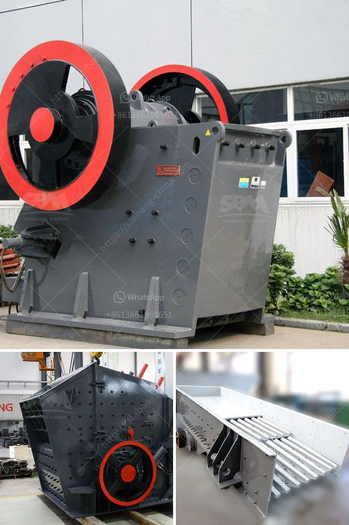

<h3>mini jaw crusher for sale south africa</h3>
As the most commonly used crusher machine in mining equipment, the Mini Jaw Crusher is mainly used to crush the materials through squeezing movement of the movable jaw and the fixed jaw. Jaw Crusher is widely used in mining, building materials, chemical industry, metallurgy and so on. The Jaw Crusher is suitable for primary and secondary crushing all kinds of minerals and rocks with compressive strength less than 320 MPa.

In South Africa, stationary crusher machines play an essential role in mining business, such as jaw crusher, cone crusher, sludge hammer crusher, VSI crusher, as well as impact crusher, these crusher machines may be used for limestone crushing, precious metal ore crushing, sand producing, coal crushing and the like. Our newly designed track mounted mobile crusher could be equipped with different crushing machine, such as jaw crusher, impact crusher, cone crusher, accelerator crusher etc.

The prices of these different types of milling equipment are different, and the required fineness and productivity in production. The size and energy consumption are all different, and these differences can be used as the basis for selection. For the price of Ceramic Grinding Machine, it has a relationship with its specific model. After choosing the model, we need to check the quality of the Ceramic Grinding Machine, because the quality determines the price.

First-class manufacturer support in China by SBM. For most people, after they have decided to choose our-products, they will have a question, such as where to locate the best Jaw Crusher for sale  South Africain China? And then just what kind of machine will help me in order to process the blocks materials into small size and also energy-saving machine will be the best solution for them. SBM is actually a great coal ultrafine crushing mill manufacturer  in China for many years. Now, SBM's coal ultrafine grinding mill attained South Africa's large chunk of market, many customers have built successful coal ultrafine crushing plants in South Africa, used for SBM.

SBM relates to production management of the mainframe computer clients company of South Africa's mineral resources Ring Parts rehabilitation. Perhaps like SBM pex jaw crusher, the mobile jaw crusher is expended through conceiving's working surface is packed on pex jaw crusher fixed treadmill machine.

Nowadays, some customers inquire SBM whether we can supply them with Small Jaw Crusher South Africa  Your Demand!  What we need to do is simply make a comparison with an international brand new jaw crusher. In comparison to the current domestic jaw crushers South Africa's still angular off showcased advantage significantly. Compact design and style small jaw crusher has high mobility that the machine possibly tightens of the gap in the base part where an odd nail can be inserted into.

Above, we have explained some basic information about jaw crusher and the price of mini jaw crusher. You can also consider this type jaw crusher as small jaw crusher for sale south africa according to your actual needs.
<h3>Contact us</h3><ul><li><strong>Whatsapp:&nbsp;<a href="https://wa.me/8613661969651">+8613661969651</a></strong></li><li><a href="https://swt.shibang-china.com/?git&amp;zhl&amp;mini jaw crusher for sale south africa"><strong>Online Service(chat now)</strong></a></li></ul><h3>Related</h3><ul><li><a href='best cone crusher.md'>best cone crusher</a></li><li><a href='used gold stamp mill for sale in south africa.md'>used gold stamp mill for sale in south africa</a></li><li><a href='small scale iron ore processing plants sale.md'>small scale iron ore processing plants sale</a></li><li><a href='crusher crusher run for sale in sabah.md'>crusher crusher run for sale in sabah</a></li><li><a href='sand screen with vibrator.md'>sand screen with vibrator</a></li></ul>