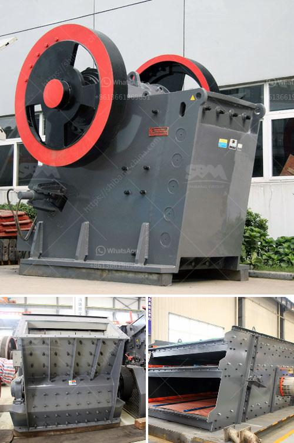

<h3>mini jaw crusher for sale used</h3>
A mini jaw crusher is a small-sized crushing machine designed for smaller scale crushing work. It is designed to crush stones or rocks into small pieces. These machines are often utilized in aggregates production, construction material recycling, and in mining operations.

Mini jaw crushers are affordable. Unlike larger stone crusher machines, mini jaw crushers are more budget-friendly. This means that they are perfect for small-scale crushing work, saving a significant amount of money. This makes mini jaw crushers ideal for crushing small amounts of materials which allows for savings in transportation costs.

Mini jaw crushers are versatile in a way that they can crush materials of all hardness levels. They can be operated independently or used as part of a larger crushing circuit. They are suitable for both primary and secondary crushing applications. Additionally, their small footprint and compact design make them easy to transport and deploy on any job site.

When looking for a mini jaw crusher for sale, it is important to consider the quality of the end product produced. The crusher must provide a consistent reduction in size and maintain a uniform grain size distribution. Ensure that the crusher has a wide opening to accommodate larger stone or rocks.

The crusher should operate with a steady power draw and as close to full rated power as practical. Ensure that the crusher is capable of providing the required size reduction. Small jaw crushers are often used for crushing softer materials, but can handle harder materials as well.

Impact crushers involve the use of impact rather than pressure to crush materials. Here the material is held within a cage, with openings of the desired size at the bottom, end or at sides to allow crushed material to escape through them. SBM provides the new and used Impact crusher machine for sale. In general, mini jaw crusher is used for crushing brittle materials, such as limestone, coal, calcite, granite, quartz, concrete, slag, etc. It is widely used in metallurgy, chemical industry, building materials, water conservancy, highways, and other departments with a compressive strength of not more than 320 MPa.

In recent years, the small jaw crusher has been favored by foreign users because of its small size, easy transportation and installation, low price, and fast profit. The models like PE-150×250, PE-200×350, and PE-400×600 have become the best choice for customers to crush concrete.

- The crushing chamber is deep and there is no dead zone, which improves the feeding capacity and output.

- Gasket type discharge opening adjustment device, reliable and convenient, with a large adjustment range, increasing the flexibility of the equipment. The lubrication system is safe and reliable, the parts are easy to replace, and the maintenance workload is small.

- Equipment energy saving: single machine energy saving is 15% to 30%, system energy saving is more than double.

- The discharging size of jaw crusher can be adjusted and the specifications of the crushed materials are diverse.

- The small jaw crusher effectively solves the problems of high operation rate and short maintenance time caused by low production of stone crusher.

Therefore, it's expected that the future development trend of the jaw crusher will be towards large-scale, automated, environmental protection, high crushing efficiency, and energy saving. The development and utilization of minerals have posed great challenges to the development of the mining industry, and the jaw crusher plays a vital role in it. With the continuous development of technology and the increase in customer demand, the jaw crusher is also developing towards a new stage.
<h3>Contact us</h3><ul><li><strong>Whatsapp:&nbsp;<a href="https://wa.me/8613661969651">+8613661969651</a></strong></li><li><a href="https://swt.shibang-china.com/?git&amp;zhl&amp;mini jaw crusher for sale used"><strong>Online Service(chat now)</strong></a></li></ul><h3>Related</h3><ul><li><a href='250 mesh hammer mill.md'>250 mesh hammer mill</a></li><li><a href='clay crusher machine.md'>clay crusher machine</a></li><li><a href='stasioner stone crusher.md'>stasioner stone crusher</a></li><li><a href='list of equipment used in iron ore mining.md'>list of equipment used in iron ore mining</a></li><li><a href='placer mining wash plant operating costs.md'>placer mining wash plant operating costs</a></li></ul>