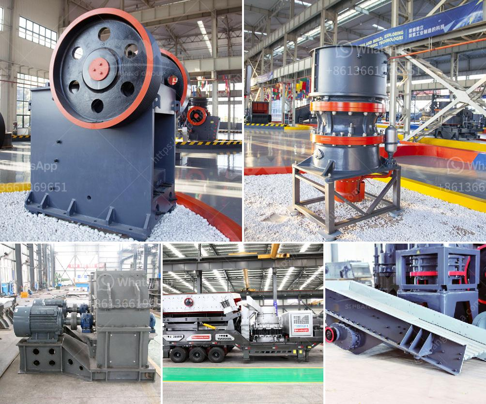

<h3>mini mobile crusher</h3>
In recent years, the construction industry has been booming in many parts of the world. With rapid urbanization and increasing population, the demand for new infrastructure projects is on the rise. However, not all construction projects are large-scale ventures that require heavy machinery and equipment. Many projects, especially in remote areas or tight spaces, call for a smaller, more efficient solution. This is where the mini mobile crusher comes into play.

A mini mobile crusher is a small, portable crusher that can be moved around easily. This type of crusher is perfect for small-scale construction projects, such as demolishing buildings, renovating roads, or repairing infrastructure. It can be transported on-site and set up within minutes, saving time and labor costs.

One of the main advantages of a mini mobile crusher is its flexibility. It can crush various types of materials, such as concrete, asphalt, stones, and rocks, into smaller, more manageable sizes. This versatility allows contractors to recycle and reuse construction waste, which helps reduce the need for new materials and minimizes environmental impact.

Another benefit of a mini mobile crusher is its cost-effectiveness. Compared to larger crushers, a mini mobile crusher is more affordable and requires less maintenance. It is also easier to transport, making it ideal for construction projects in remote areas or with limited accessibility. Moreover, the mini mobile crusher is energy-efficient, consuming less fuel or electricity compared to larger machines.

Safety is always a top priority in the construction industry. Mini mobile crushers are designed with safety features to ensure the protection of operators and workers. These features include safety guards, emergency stop buttons, and improved access to key components for maintenance and repairs.

In conclusion, a mini mobile crusher is a valuable tool for small-scale construction projects. Its compact size, flexibility, and cost-effectiveness make it an excellent choice for contractors who need a portable and efficient solution. By crushing and recycling materials on-site, these crushers contribute to a greener construction industry while saving time and money.
<h3>Contact us</h3><ul><li><strong>Whatsapp:&nbsp;<a href="https://wa.me/8613661969651">+8613661969651</a></strong></li><li><a href="https://swt.shibang-china.com/?git&amp;zhl&amp;mini mobile crusher"><strong>Online Service(chat now)</strong></a></li></ul><h3>Related</h3><ul><li><a href='jaw crusher buy in ukraine.md'>jaw crusher buy in ukraine</a></li><li><a href='hammer mill 50 hr.md'>hammer mill 50 hr</a></li><li><a href='south africa suppliers of chrome ore beneficiation plant.md'>south africa suppliers of chrome ore beneficiation plant</a></li><li><a href='high energy ball milling process.md'>high energy ball milling process</a></li><li><a href='coal crusher machine indonesia supplier.md'>coal crusher machine indonesia supplier</a></li></ul>